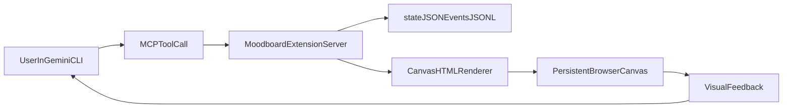

# SuperDesign MVP Plan (Extension-Only)

## Goal

Deliver a polished, reliable GSoC demo where a user can run Gemini CLI, invoke extension tools, and iteratively refine a persistent HTML design canvas before coding production UI.

## Implementation Strategy

- Build as an installable Gemini extension (no invasive core CLI changes) using the existing MCP extension pattern from `[/home/muddles/Codes/gsoc/gemini-cli/packages/cli/src/commands/extensions/examples/mcp-server/gemini-extension.json](/home/muddles/Codes/gsoc/gemini-cli/packages/cli/src/commands/extensions/examples/mcp-server/gemini-extension.json)`.
- Add first-class slash-command wrappers via extension command TOMLs, following `[/home/muddles/Codes/gsoc/gemini-cli/packages/cli/src/commands/extensions/examples/custom-commands/commands/fs/grep-code.toml](/home/muddles/Codes/gsoc/gemini-cli/packages/cli/src/commands/extensions/examples/custom-commands/commands/fs/grep-code.toml)`.
- Keep generation deterministic and HTML-first for demo reliability (no dependency on external image generation).

## MVP Scope (What Ships)

- Persistent project canvas: one HTML file + JSON state + append-only event log.
- MCP tools for: init project, add inspiration, derive tokens, generate variants, apply selected variant, iterate targeted deltas, undo/redo, export.
- Slash wrapper command set for guided control during demo (`/design:init`, `/design:add`, `/design:gen`, `/design:apply`, `/design:iterate`, `/design:undo`, `/design:redo`, `/design:export`).
- Browser viewing flow: open the same HTML canvas repeatedly to show instant visual progress.
- Demo script with a 3-5 minute “before -> iterate -> finalize” narrative.
- Concise MVP docs so reviewers can reproduce setup and run the same flow quickly.

## Proposed File/Module Layout

- New extension workspace (outside core changes), scaffolded from mcp-server example.
- Extension manifest and MCP server:
  - `[/home/muddles/Codes/gsoc/gemini-cli/packages/cli/src/commands/extensions/examples/mcp-server/gemini-extension.json](/home/muddles/Codes/gsoc/gemini-cli/packages/cli/src/commands/extensions/examples/mcp-server/gemini-extension.json)` as the reference template.
  - `example.js` equivalent replaced by `moodboard-server.js` (tool registry + handlers).
- Canvas runtime files in extension root:
  - `canvas/index.html`
  - `canvas/app.js`
  - `canvas/styles.css`
- State and history:
  - `projects/<project-id>/state.json`
  - `projects/<project-id>/events.jsonl`
  - `projects/<project-id>/assets/*`
- Extension wrapper commands:
  - `commands/design/init.toml`
  - `commands/design/add.toml`
  - `commands/design/gen.toml`
  - `commands/design/apply.toml`
  - `commands/design/iterate.toml`
  - `commands/design/undo.toml`
  - `commands/design/redo.toml`
  - `commands/design/export.toml`

## Data Model (MVP)

- `state.json` sections:
  - `project`: id, name, createdAt
  - `inspirations`: [{id, type, source, tags, notes}]
  - `tokens`: color, typography, spacing, radius, shadow
  - `layout`: sections and constraints
  - `variants`: generated candidate structures
  - `activeVariantId`
  - `meta`: lastPrompt, score, checkpoints
- `events.jsonl` is append-only and powers:
  - undo/redo
  - branch/fork in future
  - deterministic replay for demos

## Tool Contract (MCP)

- `design_init_project(name, path)`
- `design_add_inspiration(input, tags?)`
- `design_derive_tokens(projectId)`
- `design_generate_variants(projectId, count, constraints?)`
- `design_apply_variant(projectId, variantId)`
- `design_iterate(projectId, instruction)`
- `design_undo(projectId)` / `design_redo(projectId)`
- `design_export(projectId, format)`

All tools will return both machine-readable state summaries and user-friendly next-step hints for CLI usage.

## Integration Flow in Gemini CLI

- Install/link extension via existing extension system and enable it.
- Discover tools through MCP auto-registration (no CLI core command additions needed).
- Use slash wrappers loaded through extension `commands/` support as the primary demo control surface.

## Demo-Readiness Criteria

- One command initializes a project and opens initial canvas.
- Wrapper commands are discoverable and help text is clear enough for first-time usage.
- At least 3 iterations visibly change design direction (typography/color/layout).
- Undo/redo works live.
- Export produces a final HTML artifact and token JSON.
- No flaky network/model dependency required for baseline demo path.

## Documentation Deliverables

- `README.md` in the extension root with:
  - install/link steps
  - list of MCP tools and expected inputs/outputs
  - list of slash wrappers and sample invocations
- `DEMO.md` with a timed 3-5 minute script and fallback recovery steps.
- Architecture note section (in README or separate short doc) describing state model (`state.json`, `events.jsonl`) and why deterministic iteration is used for MVP reliability.

## Risks and Mitigations

- Risk: live-update jitter -> use state polling at short interval first, websocket later.
- Risk: command complexity -> provide curated wrapper commands with opinionated defaults.
- Risk: visual inconsistency -> enforce token-first rendering and deterministic variant generation.

## Stretch (if time allows)

- Palette extraction from local image inspirations.
- Side-by-side variant compare mode.
- “handoff mode” output mapping tokens to CSS variables/component hints.

