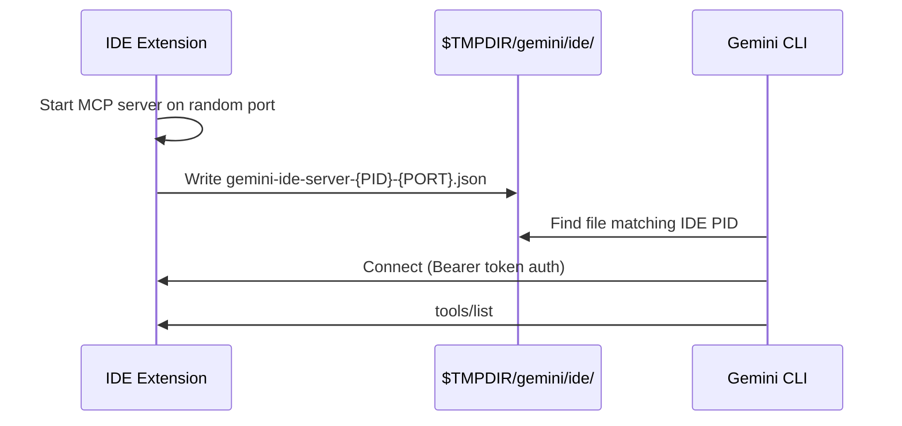
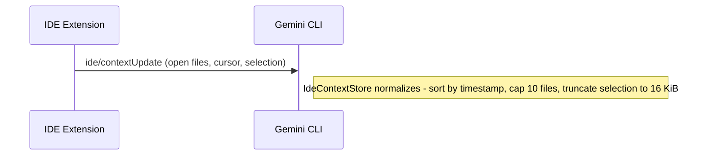
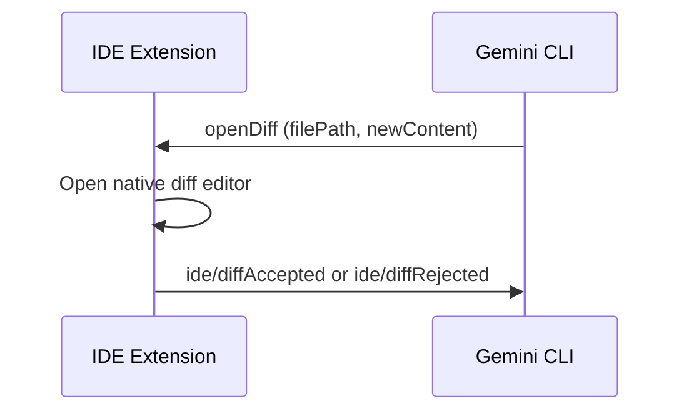
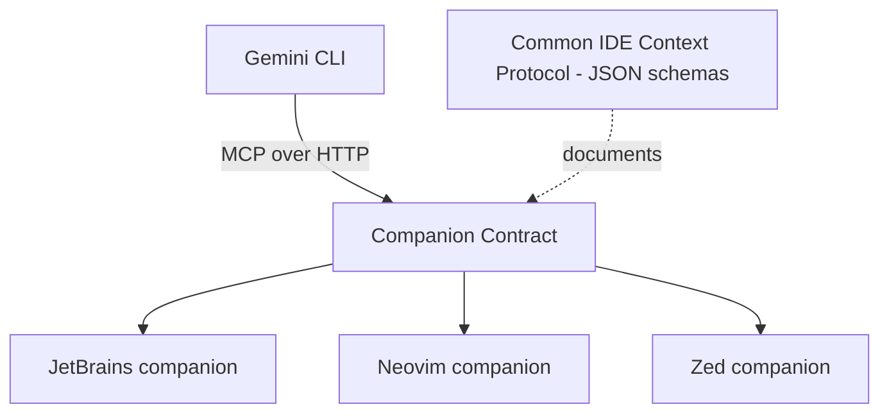
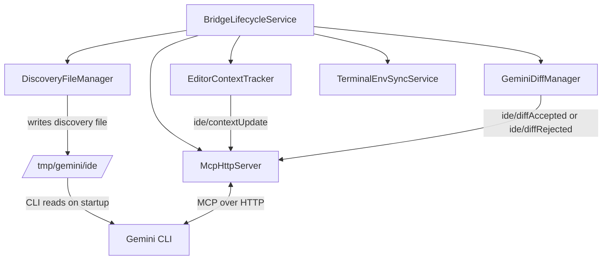
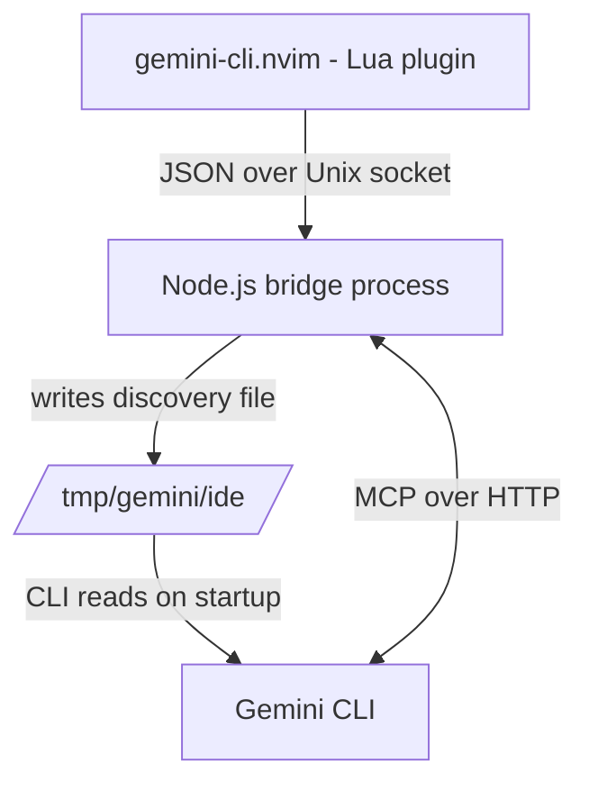
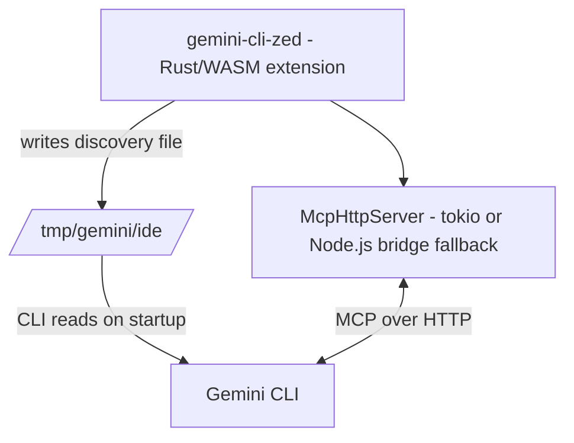
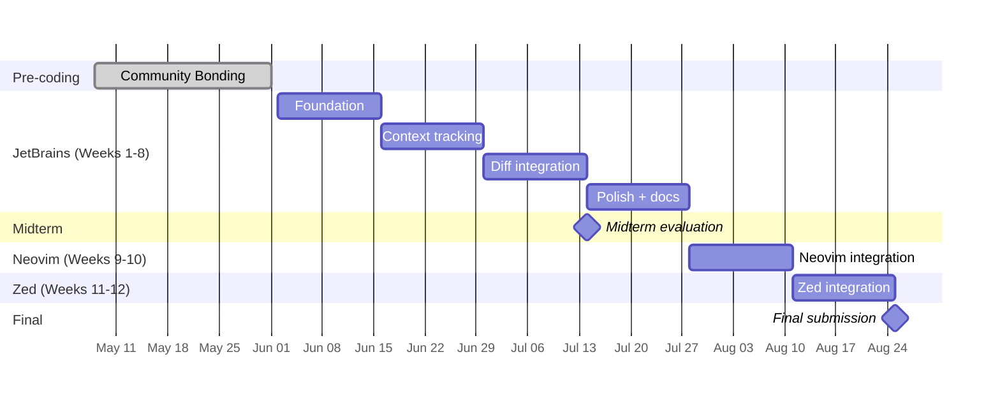

# GSoC Proposal: Expanding Gemini CLI IDE Integration Beyond VS Code

**Project:** Google Gemini CLI  
**Organization:** Google  
**Program:** Google Summer of Code  
**Idea:** Multi-IDE Integration Enhancement (#4)  
**Difficulty:** Medium  
**Size:** 175 hours

---

## Table of Contents

1. [About Me](#1-about-me)
2. [Why This Project](#2-why-this-project)
3. [Understanding the Existing System](#3-understanding-the-existing-system)
4. [My Approach](#4-my-approach)
5. [The Common IDE Context Protocol](#5-the-common-ide-context-protocol)
6. [JetBrains Plugin: Design and Implementation](#6-jetbrains-plugin-design-and-implementation)
7. [Neovim: Architecture and Plan](#7-neovim-architecture-and-plan)
8. [Zed: Architecture and Plan](#8-zed-architecture-and-plan)
9. [IDE Detection Improvements](#9-ide-detection-improvements)
10. [Why Build From Scratch](#10-why-build-from-scratch)
11. [Risks and Mitigations](#11-risks-and-mitigations)
12. [Implementation Timeline](#12-implementation-timeline)
13. [Expected Outcomes](#13-expected-outcomes)

---

## 1. About Me

> _[Your name, university, degree program, expected graduation]_

I've been working with Kotlin and the IntelliJ Platform for about [X years], mostly on [your projects]. I use Neovim for most day-to-day coding, and IntelliJ for larger JVM projects. That split workflow is part of why this project caught my attention — I've used Gemini CLI enough to appreciate what the VS Code integration does, and to notice what's missing when you're not in VS Code.

Relevant experience:

- **Kotlin / JVM:** [your work]
- **IntelliJ Platform plugin development:** [your work]
- **TypeScript / Node.js:** [your work]
- **Lua / Neovim:** [your work]
- **Open source:** [2-3 relevant links]

**GitHub:** [link]  
**Email:** [email]  
**Timezone:** [timezone]

---

## 2. Why This Project

This is GSoC idea #4 on the Gemini CLI project list: *Multi-IDE Integration Enhancement*. The idea is to expand Gemini CLI's IDE integration beyond VS Code to JetBrains IDEs, Neovim, and Zed — with a common IDE context protocol and improved IDE detection.

I'm applying for this one specifically because it sits at the intersection of the tools I use every day. I work in IntelliJ for larger JVM projects and Neovim for most other things. Gemini CLI's IDE integration — context awareness, native diffs — is genuinely useful when it works. But outside VS Code it mostly doesn't exist yet, and that gap is noticeable.

What makes this interesting technically is that the VS Code companion already defines a clean contract: MCP over HTTP, a discovery file, `ide/contextUpdate`, and diff tools. The work isn't designing a new protocol — it's implementing the existing one faithfully across three different editor environments, each with its own plugin model and constraints. JetBrains uses a JVM plugin with IntelliJ Platform APIs. Neovim needs a Lua plugin plus a bridge process because Lua's async I/O isn't suited for running an MCP HTTP server. Zed is a Rust/WASM extension. Three different runtimes, one contract.

The Common IDE Context Protocol piece is also worth doing well — right now, anyone who wants to build a companion for Helix or Sublime has to read TypeScript source to infer payload shapes. A small package of JSON schemas fixes that permanently.

### What this project delivers

- A **JetBrains companion plugin** (IntelliJ, PyCharm, WebStorm) — the largest piece
- A **Neovim integration** with bidirectional communication and diff workflow
- A **Zed integration**
- A **Common IDE Context Protocol** package (JSON schemas + design doc)
- Improved IDE detection and `/ide install` guidance for JetBrains

---

## 3. Understanding the Existing System

I started by reading the current VS Code integration carefully — the spec, the source, and the CLI-side consumer — so I could match its behavior instead of guessing.

### The VS Code companion: what it actually does

The companion is a VS Code extension (`gemini-cli-vscode-ide-companion`, published by Google) that activates on startup (`onStartupFinished`) and runs a local Express HTTP server implementing MCP. It has four main source files:

| File | Role |
|---|---|
| `extension.ts` | Entry point — activates the server, registers VS Code commands |
| `ide-server.ts` | `IDEServer` class — Express + MCP, session management, keep-alive pings |
| `open-files-manager.ts` | Tracks open files, cursor, selection; fires `ide/contextUpdate` |
| `diff-manager.ts` | Opens VS Code diff editor, fires `ide/diffAccepted` / `ide/diffRejected` |

The MCP server uses `@modelcontextprotocol/sdk` for the protocol layer, `express` for HTTP, `cors` for request filtering, and `zod` for tool parameter validation. It exposes a single `/mcp` endpoint.

The flow has three distinct phases — startup, live context, and diff:

**Phase 1: Startup and connection**



**Phase 2: Live context (continuous)**



**Phase 3: Diff workflow**



### The discovery file format

```json
{
  "port": 54321,
  "workspacePath": "/home/user/myproject",
  "authToken": "550e8400-e29b-41d4-a716-446655440000",
  "ideInfo": {
    "name": "vscode",
    "displayName": "VS Code"
  }
}
```

The file is named `gemini-ide-server-{IDE_PID}-{PORT}.json` and written with `600` permissions. The CLI traverses the process tree upward from its own PID, finds the shell, then the IDE's PID, and looks for a matching file. If multiple IDE windows are open on the same workspace, `GEMINI_CLI_IDE_SERVER_PORT` (injected into integrated terminals) is used to tie-break.

### What the CLI does with this

The CLI-side consumer is `IdeClient` in `packages/core/src/ide/ide-client.ts` — a singleton that manages the full connection lifecycle. After connecting it:

- Calls `tools/list` to discover what the companion supports (this is how it knows whether `openDiff` is available before trying to use it)
- Receives `ide/contextUpdate` notifications and normalizes them via `IdeContextStore`: sorts open files by timestamp, enforces the 10-file cap, truncates selection to 16 KiB. The `broadcastIdeContextUpdate` method on the server side ensures all connected CLI sessions get updates, not just the most recent one
- Calls `openDiff` when proposing file changes, then waits for `ide/diffAccepted`, `ide/diffRejected`, or `ide/diffClosed` (a backwards-compat alias) — serialized via a promise-based mutex so only one diff is open at a time

The `IdeClient` also supports a stdio transport fallback via `GEMINI_CLI_IDE_SERVER_STDIO_COMMAND` / `GEMINI_CLI_IDE_SERVER_STDIO_ARGS` env vars, for custom integrations that prefer subprocess communication over HTTP.

### How the CLI finds the IDE

The process tree traversal in `packages/core/src/ide/process-utils.ts` walks up from the CLI's own PID looking for a known shell, then takes its grandparent as the IDE PID (the direct parent is typically an intermediate process like VS Code's `ptyhost`):

```
VS Code:    code (IDE) ← ptyhost ← bash ← gemini CLI
JetBrains:  idea (IDE) ← terminal ← bash ← gemini CLI
                ↑
          grandparent of the shell = IDE PID written to discovery file
```

On Windows it fetches the full process table via PowerShell in one shot and traverses in memory instead. `GEMINI_CLI_IDE_PID` overrides both strategies — useful when the CLI isn't running inside the IDE's terminal at all.

One important detail for the JetBrains implementation: the VS Code extension writes the discovery file using `process.ppid` (the parent of the Node.js extension host = the VS Code window process). For JetBrains there's no extension host layer, so the correct PID is `ProcessHandle.current().pid()` — the JVM process itself. Getting this right is what makes the CLI's traversal find the correct discovery file.

### The key insight

The CLI does not care which editor is on the other end. It only cares about the contract:

- discovery file in the right place, with the right PID in the filename
- authenticated MCP connection at the port listed in that file
- `ide/contextUpdate` notifications in the `IdeContext` shape
- `openDiff` / `closeDiff` tools registered on the MCP server

That abstraction is what makes this project tractable. Each new editor companion is an independent implementation of the same well-defined interface — and the existing `IdeClient` code needs no changes to work with any of them.

---

## 4. My Approach

My guiding rule is simple: **reuse the existing companion contract**.

I am not proposing a new wire protocol. I am implementing the current one for more editors.

I will add one internal helper package: **Common IDE Context Protocol**. It documents the normalized editor model with JSON schemas so future contributors do not need to reverse-engineer payload shapes from code.



Planned delivery order:

1. JetBrains (weeks 1-8)
2. Neovim (weeks 9-10)
3. Zed (weeks 11-12)

---

## 5. The Common IDE Context Protocol

### What it is

A package at `packages/ide-companion-protocol/` containing:

- JSON schemas for discovery and context payloads
- a short design doc
- changelog

```text
packages/ide-companion-protocol/
├── README.md
├── schemas/
│   ├── discovery-record.json
│   ├── editor-snapshot.json
│   ├── context-update.json
│   └── diff-session.json
└── CHANGELOG.md
```

### Why it helps

Today, new companion authors still need to read TypeScript internals to infer details. The protocol package makes expected data shapes explicit and reusable.

### Normalized model

```typescript
interface EditorSnapshot {
  workspaceRoots: string[];
  openFiles: OpenFileEntry[];
  activeFile: ActiveFileEntry | null;
  isTrusted: boolean;
  diffSession: DiffSessionMeta | null;
}

interface OpenFileEntry {
  path: string;
  timestamp: number;
}

interface ActiveFileEntry extends OpenFileEntry {
  isActive: true;
  cursor: { line: number; character: number } | null;
  selectedText: string | null;
}

interface DiffSessionMeta {
  filePath: string;
  status: 'open' | 'accepted' | 'rejected' | 'closed';
}
```

---

## 6. JetBrains Plugin: Design and Implementation

### Design goal

A headless background plugin — no tool window, no embedded browser, no custom UI. It quietly runs the bridge so `gemini` works from the integrated terminal. From the user's perspective, it's invisible until they run `gemini /ide status` and it just says "Connected."

### Architecture



### Component responsibilities

**`BridgeLifecycleService`** is a `@Service(Service.Level.PROJECT)` — one instance per open project window. It owns the full startup/shutdown sequence. On project close, it stops the MCP server, deletes the discovery file, and clears terminal env vars. A JVM shutdown hook handles unexpected exits so stale discovery files don't accumulate.

**`McpHttpServer`** is an embedded Ktor server on port `0` (OS-assigned). It exposes `/mcp` with MCP Streamable HTTP transport — SSE for server-to-client notifications, POST for requests. Every request is validated against the auth token. Requests with an `Origin` header or non-localhost `Host` are rejected. Sessions that miss 3 consecutive 60-second keep-alive pings are cleaned up.

**`DiscoveryFileManager`** writes the file using `ProcessHandle.current().pid()` — the JVM's own PID, not a child process. The `ideInfo.displayName` comes from `ApplicationInfo.getInstance().fullApplicationName`, so it correctly says `"IntelliJ IDEA"`, `"PyCharm"`, or `"WebStorm"` depending on which product is running.

**`EditorContextTracker`** subscribes to IntelliJ's event bus and maintains a live `EditorSnapshot`:

| IDE event | API | What changes |
|---|---|---|
| File opened / focused | `FileEditorManagerListener.fileOpened` | add/update, mark active |
| File closed | `FileEditorManagerListener.fileClosed` | remove |
| File renamed / deleted | `VirtualFileListener` | update or remove path |
| Cursor moved | `CaretListener.caretPositionChanged` | update cursor on active entry |
| Selection changed | `SelectionListener.selectionChanged` | update selectedText |

All events feed into `ContextDebouncer` (50ms window). On flush, it serializes to `IdeContext` and sends `ide/contextUpdate` to all active sessions. Open files capped at 10, selected text at 16,384 chars.

**`GeminiDiffManager`** uses IntelliJ's native `com.intellij.diff.DiffManager` API — `SimpleDiffRequest` with original and proposed content, opened via `DiffManager.getInstance().showDiff()`. Accept is detected via a file save listener; reject via `FileEditorManagerListener.fileClosed`. One active diff at a time, enforced by `DiffSessionState`.

**`TerminalEnvSyncService`** uses the `TerminalCustomEnvProvider` extension point to inject `GEMINI_CLI_IDE_SERVER_PORT`, `GEMINI_CLI_IDE_WORKSPACE_PATH`, and `GEMINI_CLI_IDE_AUTH_TOKEN` into new terminal tabs. Registered as optional so the plugin works on products without the terminal plugin.

### Build target

- `org.jetbrains.intellij.platform` v2.x Gradle plugin, `sinceBuild = "241"` (IDEA 2024.1+)
- JDK 17, Kotlin 2.1
- Optional dependency on `org.jetbrains.plugins.terminal`

### Testing

- Unit tests (JUnit 5): discovery file naming/content/permissions, auth token generation, debounce timing, truncation logic, diff state machine, workspace path serialization on Linux/macOS/Windows
- Integration tests (IntelliJ Platform Test Framework): bridge startup, auth middleware, `ide/contextUpdate` delivery to a mock MCP client, full diff lifecycle, `openFile` navigation, two project windows → two independent discovery files
- Manual scenarios: multiple windows on same workspace, stale discovery file from a crashed IDE, CLI outside workspace root, terminal opened before/after bridge start

---

## 7. Neovim: Architecture and Plan

### The challenge

Neovim setups vary more than JetBrains. The CLI is often not a child process of Neovim — users run it in a tmux pane, a separate terminal, or a wezterm split. The process-tree traversal that works for VS Code and JetBrains won't always apply. The discovery file still works, but in some setups the user will need to set `GEMINI_CLI_IDE_PID` manually, or the Lua plugin needs to inject it into the shell environment. I'll document this clearly.

The other constraint is that Lua's async I/O (`vim.loop` / libuv) isn't suited for running a full MCP HTTP server with SSE. Rather than fighting that, I'll use a small Node.js bridge process — the same `@modelcontextprotocol/sdk` already used by the VS Code companion, so the server-side code is minimal.

### Architecture



The bridge is started with `vim.fn.jobstart()` and bundled inside the plugin. Neovim's PID (`vim.fn.getpid()`) is passed to the bridge at startup so the discovery file uses the correct PID — not the bridge's own process ID.

### Event mapping

| Neovim autocmd | Maps to |
|---|---|
| `BufEnter` | File focused, update timestamp, mark active |
| `BufLeave` | File unfocused |
| `CursorMoved`, `CursorMovedI` | Cursor update (debounced 50ms) |
| `TextYankPost` | Selected text update |
| `BufDelete` | File closed |
| `VimLeavePre` | Stop bridge, delete discovery file |

### Diff UX

Neovim has no built-in diff-accept/reject toolbar. The integration opens a diff split using `vim.diff()` and registers configurable buffer-local keymaps:

- `<leader>ga` — accept (fires `ide/diffAccepted`)
- `<leader>gr` — reject (fires `ide/diffRejected`)

This is a different UX from VS Code and JetBrains, but it fits how Neovim users actually work. I'll document it clearly so it's obvious, not surprising.

---

## 8. Zed: Architecture and Plan

Zed extensions are Rust/WASM modules running inside the editor process. Unlike Neovim, there's no need for a separate bridge process — the extension can host the MCP server directly using `tokio` if the WASM sandbox allows outbound TCP. I'll verify this during community bonding. If it doesn't, the Neovim bridge model is already proven by week 11 and adapting it for Rust is straightforward.



Zed exposes `workspace.observe_open_buffers()` and `editor.observe_selections()` — these map directly onto the `EditorSnapshot` model. `isTrusted` defaults to `true` since Zed has no workspace trust concept. Diff handling uses Zed's native diff view; accept maps to saving the proposed content, reject to closing without saving.

The PID is obtained via `std::process::id()`. The discovery file follows the same naming convention as all other companions.

---

## 9. IDE Detection Improvements

Core IDE discovery already works through process traversal plus discovery files.

I plan to improve `/ide install` messaging for JetBrains:

- detect JetBrains process names
- show marketplace guidance (manual install)
- improve errors when IDE is detected but companion is missing

---

## 10. Why Build From Scratch

I reviewed existing IntelliJ plugins that bridge IDEs to external tools. Most include UI-heavy stacks (JCEF, bundled binaries, custom protocols). That is not what Gemini CLI needs.

For this project, a clean headless implementation is simpler to maintain and easier to reason about. The reference behavior is already defined by Gemini CLI's VS Code companion and the companion spec.

---

## 11. Risks and Mitigations

- **Kotlin MCP SDK gaps:** if needed, implement transport directly with Ktor
- **Diff accept/reject detection in JetBrains:** validate save/close heuristics with integration tests
- **Terminal env provider availability:** optional dependency, keep discovery-based fallback
- **Neovim bridge dependency on Node.js:** document requirement and evaluate fallback options
- **Zed networking constraints:** verify in bonding; use bridge fallback if required
- **Multiple IDE windows:** rely on env var tie-breakers and test explicitly

---

## 12. Implementation Timeline

Coding period dates in this proposal: **June 2, 2025 to August 25, 2025**.



### Community Bonding — May 8 to June 1

Before writing any code, I want zero open architecture questions. I'll read `ide-companion-spec.md`, `ide-server.ts`, `ide-client.ts`, and `ide-connection-utils.ts` end to end and note anything unclear for my mentor. I'll evaluate `io.modelcontextprotocol:kotlin-sdk` to decide whether it handles Streamable HTTP transport or whether I need to implement that layer directly with Ktor. I'll verify Zed's WASM networking situation. And I'll get `runIde` working locally so day one of coding is actual coding.

### Weeks 1–2 (June 2–15): JetBrains Foundation

`BridgeLifecycleService`, `McpHttpServer` with auth middleware, `DiscoveryFileManager`, `AuthTokenProvider`. The goal is a plugin that boots, writes a discovery file, and accepts an authenticated MCP connection. Nothing else yet.

**Milestone:** `gemini /ide status` connects to the JetBrains plugin and says "Connected."

### Weeks 3–4 (June 16–29): JetBrains Context Tracking

`EditorContextTracker` + `ContextDebouncer` + `ide/contextUpdate`. The tricky part is thread safety — IntelliJ's event bus fires on the EDT, and the debouncer and notification send must run on a background coroutine without blocking it.

**Milestone:** `gemini /ide status` shows the correct open files and cursor position from IntelliJ.

### Weeks 5–6 (June 30 – July 13): JetBrains Diff Integration

`GeminiDiffManager` + `DiffSessionState` + `openDiff`/`closeDiff` handlers + accept/reject notifications. Extra attention on edge cases: user saves from a different tab, closes diff without interacting, file modified externally while diff is open.

**Milestone:** Ask Gemini to modify a file from IntelliJ's terminal. Diff opens. Accept and reject both work. CLI receives the correct notification.

> **Midterm evaluation — July 14–18.** JetBrains is feature-complete and passing tests. This is the natural checkpoint.

### Weeks 7–8 (July 14–27): JetBrains Polish, Docs, Protocol Package

`OpenFileToolHandler`, `TerminalEnvSyncService`, file rename/delete handling, multi-project validation. Full manual scenario matrix. Performance check — context tracker must not block the EDT. Packaging validation.

Also: `packages/jetbrains-ide-companion/README.md`, `packages/ide-companion-protocol/` schemas and README, updated `docs/ide-integration/index.md`.

**Milestone:** Plugin ZIP is installable from disk. README is complete. Protocol package is published.

### Weeks 9–10 (July 28 – August 10): Neovim Integration

Lua plugin + Node.js bridge + discovery file (Neovim PID) + `ide/contextUpdate` + diff workflow with keymaps. The bridge reuses `@modelcontextprotocol/sdk` so the server side is minimal — the work is the Lua plugin and the IPC layer. Test coverage includes bridge lifecycle, context delivery, and the diff accept/reject flow.

**Milestone:** Run `gemini` in a Neovim terminal split. `/ide status` shows open buffers and cursor. Diff opens in a split buffer. `<leader>ga` accepts, `<leader>gr` rejects.

### Weeks 11–12 (August 11–25): Zed Integration and Final Submission

Zed extension: discovery file, MCP server, `ide/contextUpdate`, diff workflow. Self-contained if WASM networking is available; bridge process model if not (already proven by Neovim). Final week: end-to-end testing across all three editors, Zed README, updated `docs/ide-integration/`, final GSoC report.

**Milestone:** All three companions working, documented, and ready for code review. Final report submitted by August 25.

---

## 13. Expected Outcomes

By the end of the project, these deliverables should exist:

| Outcome | Deliverable | Window |
|---|---|---|
| JetBrains companion | `packages/jetbrains-ide-companion/` | Weeks 1-8 |
| Neovim companion | `packages/neovim-ide-companion/` | Weeks 9-10 |
| Zed companion | `packages/zed-ide-companion/` | Weeks 11-12 |
| Common protocol package | `packages/ide-companion-protocol/` | Weeks 7-8 |
| Better IDE guidance | improved detection and install messaging | ongoing |
| Docs | per-editor READMEs + integration docs updates | ongoing |

In practical terms: IntelliJ, PyCharm, WebStorm, Neovim, and Zed users should be able to run `gemini` and get editor-aware context + native diff workflows, not a copy/paste loop.

**Stretch goal (time permitting):** add JetBrains guidance to `gemini /ide install`.
