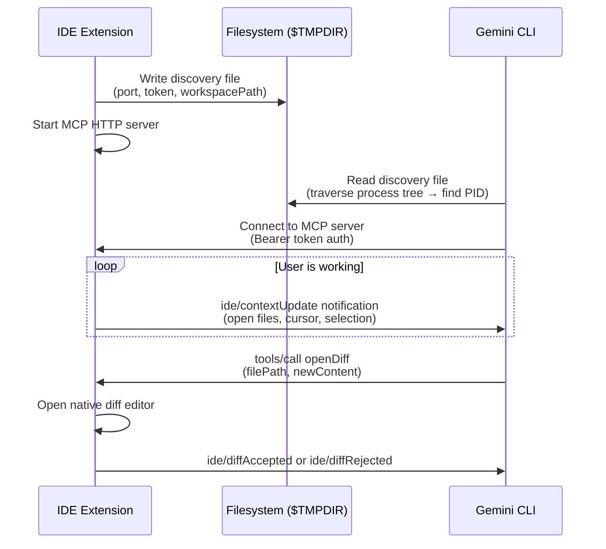
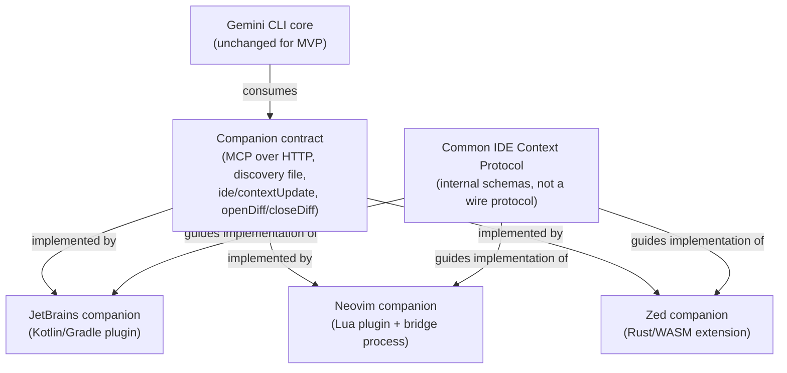
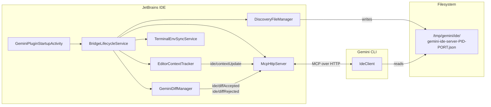
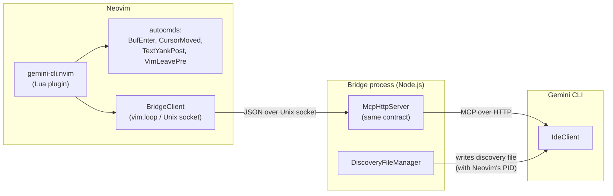
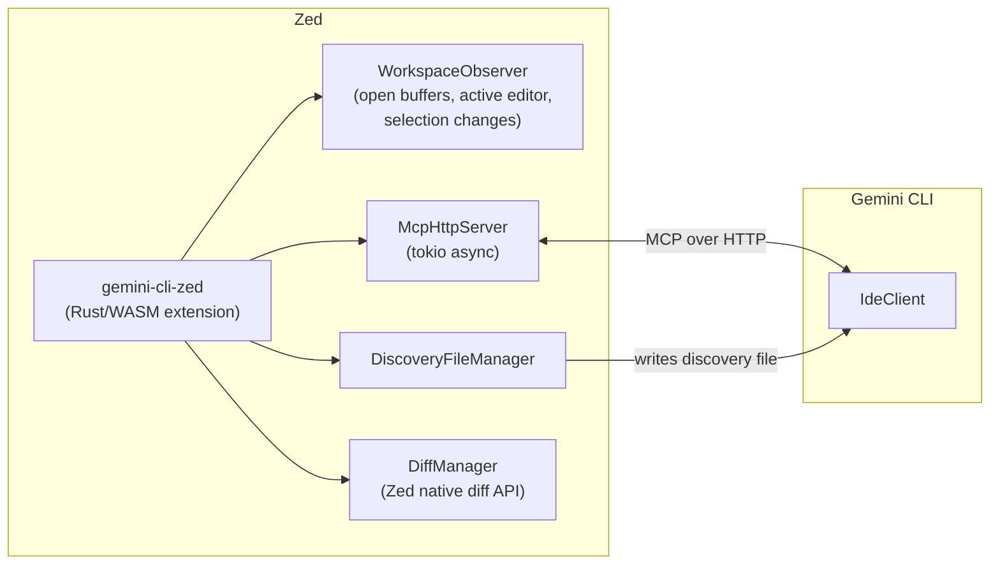
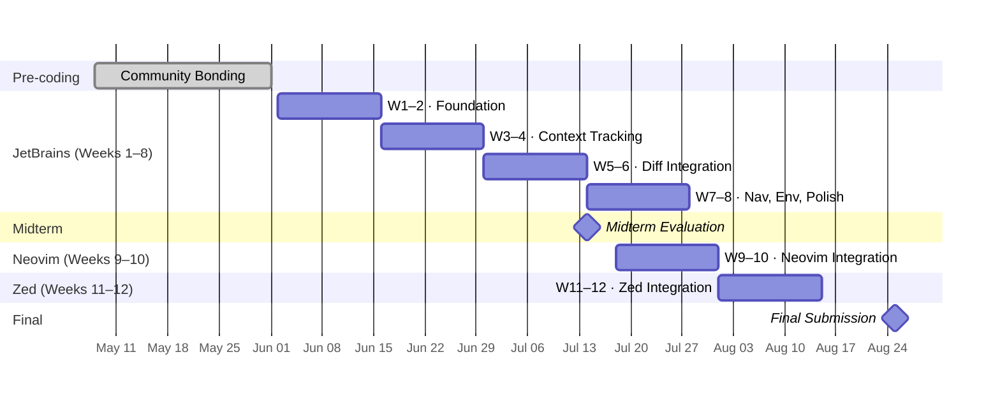

# GSoC Proposal: Expanding Gemini CLI IDE Integration Beyond VS Code

**Project:** Google Gemini CLI  
**Organization:** Google  
**Program:** Google Summer of Code  
**Difficulty:** Hard  
**Size:** Large (350 hours)

---

## Table of Contents

1. [About Me](#1-about-me)
2. [The Problem I Want to Solve](#2-the-problem-i-want-to-solve)
3. [Understanding the Existing System](#3-understanding-the-existing-system)
4. [My Approach](#4-my-approach)
5. [The Common IDE Context Protocol](#5-the-common-ide-context-protocol)
6. [JetBrains Plugin — Design and Implementation](#6-jetbrains-plugin--design-and-implementation)
7. [Neovim — Architecture and Plan](#7-neovim--architecture-and-plan)
8. [Zed — Architecture and Plan](#8-zed--architecture-and-plan)
9. [IDE Detection Improvements](#9-ide-detection-improvements)
10. [Why Build From Scratch](#10-why-build-from-scratch)
11. [Risks and How I'll Handle Them](#11-risks-and-how-ill-handle-them)
12. [Implementation Timeline](#12-implementation-timeline)
13. [Expected Outcomes](#13-expected-outcomes)

---

## 1. About Me

> _[Your name, university, degree program, expected graduation]_

I've been writing Kotlin and working with the IntelliJ Platform for about [X years], mostly building [describe projects — e.g., internal tooling plugins, open source contributions]. I use Neovim as my daily driver for most work but switch to IntelliJ for larger Java/Kotlin projects, which is exactly why this project caught my attention — I've felt the friction of Gemini CLI not knowing what I'm working on.

My relevant experience:

- **Kotlin / JVM:** [describe — e.g., built X plugin, contributed to Y project]
- **IntelliJ Platform plugin development:** [describe — e.g., wrote a plugin that does Z, familiar with the platform's service/listener model]
- **TypeScript / Node.js:** [describe — relevant for reading and understanding the Gemini CLI codebase]
- **Lua / Neovim:** [describe — e.g., maintain a Neovim config with custom plugins, familiar with autocmds and the Lua API]
- **Open source:** [list 2–3 relevant PRs or projects with links]

**GitHub:** [link]  
**Email:** [email]  
**Timezone:** [timezone]

---

## 2. The Problem I Want to Solve

Gemini CLI's IDE integration is genuinely impressive when it works. The CLI knows which files you have open, where your cursor is, what you've selected — and when you ask it to modify a file, the diff appears right inside your editor. It feels like pair programming, not copy-pasting.

The problem is that this experience only exists for VS Code users today.

I use IntelliJ IDEA for a large Kotlin codebase at [university/project]. When I run `gemini` from the integrated terminal, it has no idea what file I'm looking at. I have to manually paste context, describe what I'm working on, and then copy the suggested changes back by hand. The diff workflow — which VS Code users get natively — simply doesn't exist. It's a significant enough gap that I often switch editors just to use the CLI properly, which defeats the purpose.

The same is true for Neovim users, who are arguably the most natural audience for a terminal-first AI tool. And Zed, which has AI integration as a first-class design goal, has no Gemini CLI companion at all.

This isn't a niche problem. JetBrains IDEs have [~30% of the developer market](https://www.jetbrains.com/research/developer-ecosystem/). Neovim is the editor of choice for a large portion of the developer community that lives in the terminal. These are exactly the users most likely to reach for a CLI-based AI tool — and right now they get a second-class experience.

**What I want to build:** A JetBrains companion plugin that gives IntelliJ, PyCharm, and WebStorm users the same integration VS Code users already have. A working Neovim integration with bidirectional communication. A Zed extension that completes the picture for that editor. And a Common IDE Context Protocol that makes every future editor integration — Helix, Sublime, whatever comes next — straightforward to build without starting from scratch.

---

## 3. Understanding the Existing System

Before proposing anything, I spent time reading through the existing codebase to understand how the VS Code integration actually works. The design is clean and worth understanding in detail, because it's the contract I'll be implementing.

### How the VS Code companion works today

The companion is a local HTTP server running inside the IDE extension. When VS Code starts, the extension:

1. Starts an MCP server on a random loopback port
2. Writes a discovery file to `$TMPDIR/gemini/ide/` so the CLI can find it
3. Watches for file/cursor/selection changes and pushes `ide/contextUpdate` notifications to the CLI
4. Registers `openDiff` and `closeDiff` tools that the CLI calls when it wants to show proposed changes

On the CLI side, when you run `gemini` inside VS Code's terminal, it traverses the process tree to find the IDE's PID, reads the discovery file, connects to the MCP server, and from that point on it has live context about what you're doing in the editor.

Here's the full picture:



The discovery file format is:

```json
{
  "port": 54321,
  "workspacePath": "/home/user/myproject",
  "authToken": "550e8400-e29b-41d4-a716-446655440000",
  "ideInfo": {
    "name": "vscode",
    "displayName": "VS Code"
  }
}
```

The companion spec (`docs/ide-integration/ide-companion-spec.md`) documents all of this precisely. My job is to implement the same contract for JetBrains — using JetBrains Platform APIs instead of VS Code APIs, but producing identical behavior from the CLI's perspective.

### What the CLI expects

The CLI's `IdeClient` (`packages/core/src/ide/ide-client.ts`) is the consumer of all this. It:
- Discovers the IDE via process tree traversal + discovery file
- Connects via MCP and calls `tools/list` to discover available tools
- Receives `ide/contextUpdate` notifications and normalizes them (sorts files by timestamp, truncates to 10 files, truncates selection to 16 KiB)
- Calls `openDiff` when proposing file changes, waits for `ide/diffAccepted` or `ide/diffRejected`

The important insight here is that **the CLI doesn't care which editor it's talking to**. As long as the companion implements the contract correctly, everything works. This is the right abstraction, and it's what makes multi-editor support tractable.

---

## 4. My Approach

The core principle is simple: **implement the companion contract, not a new protocol.**

I'm not going to invent a new communication format or a new abstraction layer between Gemini CLI and editors. The companion spec already exists and is well-designed. My job is to implement it faithfully for each new editor.

What I *will* add is a **Common IDE Context Protocol** — a small package of language-agnostic JSON schemas that captures the normalized editor state model. This isn't a new external protocol; it's an internal reference that makes it easier for future contributors to build Neovim, Zed, or any other editor companion without having to reverse-engineer the payload shapes from the TypeScript source. Think of it as the companion spec's implementation guide.

The work breaks into three layers:



All three editor integrations are in scope for this GSoC — not as stretch goals, but as planned deliverables. The sequencing is deliberate: JetBrains first (weeks 1–8) because it's the most complex and has the largest user impact, Neovim next (weeks 9–10) which reuses the same companion contract with a different runtime model, then Zed (weeks 11–12) which is the most self-contained. The Common IDE Context Protocol and documentation land alongside each implementation as it's completed.

The 12-week coding period (June 2 – August 25) fits this cleanly. JetBrains is complete before the midterm evaluation on July 14 — a natural checkpoint. Neovim and Zed follow in the second half, each getting two focused weeks.

---

## 5. The Common IDE Context Protocol

### What it is

A small package at `packages/ide-companion-protocol/` containing JSON schemas and a design document. It defines the normalized editor state model that every companion maps its native APIs into before serializing to Gemini's external format.

```
packages/ide-companion-protocol/
├── README.md                 # Design rationale, how to use
├── schemas/
│   ├── discovery-record.json # The discovery file format
│   ├── editor-snapshot.json  # Normalized editor state
│   ├── context-update.json   # ide/contextUpdate payload
│   └── diff-session.json     # Diff session lifecycle
└── CHANGELOG.md
```

### Why this matters

Right now, if someone wants to build a Sublime Text or Helix companion, they have to read the TypeScript source of `ide-server.ts` and `open-files-manager.ts` to figure out the exact payload shapes. The companion spec documents the *contract* but not the *normalized model* that sits between editor APIs and the wire format. This package fills that gap.

### The normalized model

Every editor has different APIs for "what files are open" and "where is the cursor." The normalized model is the common shape they all map into:

```typescript
// This is an internal model, not a wire format.
// Each editor maps its native APIs into this, then serializes to IdeContext.
interface EditorSnapshot {
  workspaceRoots: string[];       // absolute paths to workspace root(s)
  openFiles: OpenFileEntry[];     // all open files, sorted by last focus time
  activeFile: ActiveFileEntry | null;
  isTrusted: boolean;             // defaults to true for editors without this concept
  diffSession: DiffSessionMeta | null;
}

interface OpenFileEntry {
  path: string;       // absolute on-disk path; virtual/unsaved files excluded
  timestamp: number;  // unix ms of last focus
}

interface ActiveFileEntry extends OpenFileEntry {
  isActive: true;
  cursor: { line: number; character: number } | null;  // 1-based
  selectedText: string | null;                          // pre-truncation
}

interface DiffSessionMeta {
  filePath: string;
  status: 'open' | 'accepted' | 'rejected' | 'closed';
}
```

The mapping to Gemini's external `IdeContext` is straightforward:

```
EditorSnapshot.workspaceRoots → discovery file workspacePath
EditorSnapshot.openFiles      → IdeContext.workspaceState.openFiles
EditorSnapshot.activeFile     → the entry with isActive: true, cursor, selectedText
EditorSnapshot.isTrusted      → IdeContext.workspaceState.isTrusted
```

Truncation (10 files, 16 KiB selection) is enforced by the CLI's `IdeContextStore`. Companions apply the same limits as a best-effort measure to avoid sending oversized payloads.

---

## 6. JetBrains Plugin — Design and Implementation

### The big picture

The plugin is a **headless background service** — no UI, no tool window, no embedded browser. When IntelliJ starts, the plugin starts an MCP server, writes a discovery file, and begins watching for editor events. That's it. From the user's perspective, it's invisible until they run `gemini` in the integrated terminal and it just works.



### Module structure

```
packages/jetbrains-ide-companion/
├── build.gradle.kts
├── gradle.properties
├── src/main/kotlin/com/google/gemini/ide/jetbrains/
│   ├── GeminiPluginStartupActivity.kt
│   ├── bridge/
│   │   ├── BridgeLifecycleService.kt   # owns the full lifecycle per project window
│   │   ├── McpHttpServer.kt            # embedded HTTP + MCP + auth
│   │   └── AuthTokenProvider.kt        # UUID token generation
│   ├── discovery/
│   │   └── DiscoveryFileManager.kt     # writes/deletes the discovery file
│   ├── context/
│   │   ├── EditorContextTracker.kt     # subscribes to IDE events
│   │   └── ContextDebouncer.kt         # 50ms coalescing
│   ├── diff/
│   │   ├── GeminiDiffManager.kt        # wraps IntelliJ DiffManager API
│   │   └── DiffSessionState.kt         # one active diff at a time
│   ├── terminal/
│   │   └── TerminalEnvSyncService.kt   # injects env vars into new terminals
│   └── tools/
│       ├── OpenDiffToolHandler.kt
│       ├── CloseDiffToolHandler.kt
│       └── OpenFileToolHandler.kt
└── src/test/kotlin/...
```

### How each subsystem works

**`BridgeLifecycleService`** is a `@Service(Service.Level.PROJECT)` — one instance per open project window. It owns startup and shutdown: starts the MCP server, gets the assigned port, generates the auth token, writes the discovery file, registers terminal env vars, starts the context tracker. On project close, it reverses all of this. If the JVM exits unexpectedly, a shutdown hook deletes the discovery file so the CLI doesn't find a stale entry pointing to a dead process.

**`McpHttpServer`** is an embedded Ktor server listening on port `0` (OS-assigned). It exposes a single `/mcp` endpoint implementing MCP Streamable HTTP transport — SSE for server-to-client notifications, POST for client-to-server requests. Every request is validated against the auth token (`Authorization: Bearer <token>`), and requests with an `Origin` header or a non-localhost `Host` are rejected. Sessions that miss 3 consecutive 60-second keep-alive pings are cleaned up automatically.

**`DiscoveryFileManager`** writes the discovery file with the JVM's own PID (`ProcessHandle.current().pid()`), not a child process PID. This is the key difference from VS Code, where the extension uses `process.ppid`. The file is written with `600` permissions (owner read/write only), and the directory is created with `700`. The `ideInfo.displayName` is read from `ApplicationInfo.getInstance().fullApplicationName`, so it correctly says `"IntelliJ IDEA"`, `"PyCharm"`, or `"WebStorm"` depending on which product is running.

**`EditorContextTracker`** subscribes to IntelliJ's event bus and maintains a live `EditorSnapshot`:

| IDE Event | API | What changes |
|---|---|---|
| File opened / focused | `FileEditorManagerListener.fileOpened` | Add to open files, update timestamp, mark active |
| File closed | `FileEditorManagerListener.fileClosed` | Remove from open files |
| File renamed | `VirtualFileListener.propertyChanged` | Update path in snapshot |
| File deleted | `VirtualFileListener.fileDeleted` | Remove from snapshot |
| Cursor moved | `CaretListener.caretPositionChanged` | Update cursor on active entry |
| Selection changed | `SelectionListener.selectionChanged` | Update selectedText on active entry |

All of these feed into `ContextDebouncer`, which coalesces events within a 50ms window. On flush, it serializes the snapshot to `IdeContext` and sends an `ide/contextUpdate` notification to all active MCP sessions. Virtual files and unsaved buffers without an on-disk path are excluded. The open files list is capped at 10 and selected text at 16,384 characters before sending.

**`GeminiDiffManager`** uses IntelliJ's native `com.intellij.diff.DiffManager` API. When `openDiff` is called, it creates a `SimpleDiffRequest` with the current file content and the proposed new content, opens it with `DiffManager.getInstance().showDiff()`, and registers listeners for the accept (file save) and reject (close without save) actions. Only one diff can be open at a time — a second `openDiff` call while one is already open returns an error. I chose the native `DiffManager` over a custom streaming diff UI deliberately: it gives users the familiar IntelliJ diff experience (keyboard shortcuts, inline editing, the standard toolbar) without any custom UI to maintain.

**`TerminalEnvSyncService`** uses the `TerminalCustomEnvProvider` extension point (available since IDEA 2022.3) to inject `GEMINI_CLI_IDE_SERVER_PORT`, `GEMINI_CLI_IDE_WORKSPACE_PATH`, and `GEMINI_CLI_IDE_AUTH_TOKEN` into new terminal tabs. This is the tie-breaking mechanism the CLI uses when multiple IDE windows are open on the same workspace. It's registered as optional (`depends optional="true"`) so the plugin works on older platform versions and non-IntelliJ products that don't bundle the terminal plugin.

**`OpenFileToolHandler`** implements `jetbrains.openFile(path, line?, column?)`. It opens the file via `FileEditorManager`, then navigates the caret to the specified position using `editor.caretModel.moveToLogicalPosition()` and scrolls it into view. Line and column are 1-based in the tool input and converted to 0-based IntelliJ coordinates internally.

### Build setup

```kotlin
// build.gradle.kts
plugins {
    kotlin("jvm") version "2.1.0"
    id("org.jetbrains.intellij.platform") version "2.7.2"
}

intellijPlatform {
    intellijIdeaCommunity("2024.1")  // sinceBuild = "241"
    plugins(listOf("org.jetbrains.plugins.terminal"))
}

kotlin { jvmToolchain(17) }
```

Targeting `sinceBuild = "241"` (IDEA 2024.1) covers all current JetBrains products. The only bundled plugin dependency is `terminal`, and it's optional — the plugin degrades gracefully without it.

### `plugin.xml`

```xml
<idea-plugin>
  <id>com.google.gemini.ide.jetbrains</id>
  <name>Gemini CLI Companion</name>
  <vendor>Google</vendor>

  <depends>com.intellij.modules.platform</depends>
  <depends optional="true" config-file="gemini-terminal.xml">
    org.jetbrains.plugins.terminal
  </depends>

  <extensions defaultExtensionNs="com.intellij">
    <postStartupActivity
      implementation="...GeminiPluginStartupActivity"/>
    <projectService
      serviceImplementation="...BridgeLifecycleService"/>
    <notificationGroup id="Gemini CLI" displayType="BALLOON"/>
  </extensions>

  <actions>
    <!-- Diagnostic actions, visible in Help menu -->
    <action id="gemini.showBridgeInfo" text="Show Gemini Bridge Info"/>
    <action id="gemini.restartBridge"  text="Restart Gemini Bridge"/>
  </actions>
</idea-plugin>
```

### Testing strategy

I'll write tests at three levels:

**Unit tests** (JUnit 5, no IDE runtime): discovery file naming and content, auth token generation, debounce timing, context truncation logic (10 files, 16 KiB selection), diff session state machine, workspace path serialization on Linux/macOS/Windows.

**Integration tests** (IntelliJ Platform Test Framework): bridge startup and discovery file creation, auth middleware (missing/wrong token → 401), `ide/contextUpdate` delivery to a mock MCP client, full diff lifecycle (open → accept → notification, open → reject → notification), `openFile` navigation to correct line/column, two project windows producing independent discovery files.

**Manual acceptance scenarios** I'll run before each milestone:
- Two IDE windows on different repos — CLI connects to the right one
- Same workspace in two windows — env var tie-breaking works
- Dirty buffer — diff opens against on-disk content, not in-memory
- Stale discovery file from a crashed IDE — CLI skips it correctly
- CLI outside the workspace root — rejected with a clear error
- Terminal opened before plugin starts — no env vars (documented)
- Terminal opened after plugin starts — all three env vars present

---

## 7. Neovim — Architecture and Plan

### The challenge

Neovim is different from JetBrains in one important way: the CLI is often *not* a child process of Neovim. Users run Gemini CLI in a tmux pane, a split terminal, or a completely separate window. The process-tree traversal that works for VS Code and JetBrains won't always work here.

The discovery file is still the right mechanism — but the user may need to set `GEMINI_CLI_IDE_PID` manually in some setups, or the Neovim plugin needs to inject it into the shell environment. This is a known limitation that I'll document clearly.

The other challenge is that Lua's async I/O (`vim.loop` / libuv) isn't well-suited for running a full MCP HTTP server with SSE. Rather than fighting that, I'll use a small bridge process.

### Architecture



The bridge process is a small Node.js script (< 200 lines, using `@modelcontextprotocol/sdk`) bundled inside the Lua plugin. The Lua plugin starts it with `vim.fn.jobstart()` and communicates over a Unix socket using newline-delimited JSON. The bridge writes the discovery file using Neovim's PID (obtained via `vim.fn.getpid()` and passed to the bridge at startup), not its own — this is what makes the CLI's process-tree traversal work when the CLI is running inside Neovim's terminal.

**Context events** map cleanly to Neovim's autocmd system:

| Neovim event | Maps to |
|---|---|
| `BufEnter` | File focused, update timestamp, mark active |
| `BufLeave` | File unfocused |
| `CursorMoved`, `CursorMovedI` | Cursor position update (debounced 50ms) |
| `TextYankPost` | Selected text update |
| `BufDelete` | File closed |
| `VimLeavePre` | Stop bridge, delete discovery file |

**Diff handling** is the biggest UX difference from VS Code and JetBrains. Neovim has no built-in diff-accept/reject toolbar. The integration will open a diff buffer using `vim.diff()` and register buffer-local keymaps (`<leader>ga` to accept, `<leader>gr` to reject). These are configurable. The keymaps fire the appropriate notifications to the bridge, which forwards them to the CLI. I'll document this clearly — it's a different UX, not a missing feature.

### What I'll deliver for Neovim

A fully working integration: Lua plugin + bridge process + discovery file + `ide/contextUpdate` + diff workflow with accept/reject keymaps. This lands in weeks 9–10, after the JetBrains plugin is stable. The bridge process reuses the same Node.js MCP SDK already used by the VS Code companion, so the server-side code is minimal — the bulk of the work is the Lua plugin and the IPC layer between them.

Test coverage will include the bridge startup/shutdown lifecycle, discovery file creation with the correct Neovim PID, context update delivery, and the diff accept/reject flow. Manual testing will cover the tmux and split-terminal scenarios where process-tree traversal doesn't apply.

---

## 8. Zed — Architecture and Plan

### Why Zed is different

Zed extensions are Rust/WASM modules running inside the editor process. Unlike Neovim, there's no need for a separate bridge process — the extension can host the MCP HTTP server directly using `tokio`. The extension system is newer and some APIs are still evolving, so I'll verify network I/O capabilities early in the community bonding period.

### Architecture



Zed exposes `workspace.observe_open_buffers()` and `editor.observe_selections()` — these map directly onto the `EditorSnapshot` model. The `isTrusted` field defaults to `true` since Zed has no workspace trust concept. Diff handling uses Zed's native diff view; accept maps to saving the proposed content, reject maps to closing without saving.

### What I'll deliver for Zed

A working extension: discovery file, MCP server, `ide/contextUpdate`, and the diff workflow. This lands in weeks 11–12. Zed is actually the most self-contained of the three — the Rust/WASM extension model is clean, there's no separate bridge process needed, and the Zed API for workspace and buffer events is well-documented.

The main uncertainty is whether Zed's WASM sandbox allows outbound TCP. I'll verify this during community bonding. If it doesn't, the fallback is the same bridge process model as Neovim — the Lua plugin architecture is already proven by that point, so adapting it for Zed is straightforward. Either way, a working Zed integration ships by the end of week 12.

---

## 9. IDE Detection Improvements

The CLI's existing process-tree traversal (`ide-connection-utils.ts`) already handles arbitrary depth, so JetBrains works without any core changes — the plugin writes the discovery file with the JVM's own PID, and the CLI finds it by traversing up through the JVM process.

The one gap is `/ide install`. Today it only knows about VS Code. I'll add JetBrains detection as a stretch goal:

- Detect JetBrains by checking process names (`idea`, `pycharm`, `webstorm`, `goland`, etc.) in the process tree
- Since JetBrains doesn't support CLI-based plugin installation, the installer will display a message with the JetBrains Marketplace URL: `"To install the Gemini CLI Companion for JetBrains, search for 'Gemini CLI Companion' in your IDE's plugin marketplace"`
- Update error messages to include JetBrains-specific guidance when the IDE is detected but the plugin isn't running

---

## 10. Why Build From Scratch

There are existing open-source IntelliJ plugins that implement IDE-to-tool bridges, and I looked at several of them while preparing this proposal. The pattern I kept seeing was: a JCEF webview for the UI, stdio IPC to a bundled binary, and a proprietary message protocol tying it all together.

That architecture makes sense for those tools — they need a rich GUI embedded in the IDE. But the Gemini CLI companion needs none of that. It's a headless background service. No UI, no binary to bundle, no proprietary protocol. The companion spec already defines exactly what it needs to do.

Forking an existing plugin and removing everything that doesn't apply would be harder than starting fresh, and would leave the codebase carrying the conceptual weight of the original design. A clean implementation against the companion spec is simpler, more maintainable, and easier for future contributors to understand.

The primary reference for this project is Gemini CLI's own VS Code companion (`packages/vscode-ide-companion`). The JetBrains plugin is a port of its behavior — same discovery contract, same tools, same notification payloads — using JetBrains Platform APIs. The companion spec exists precisely so this kind of port is unambiguous.

---

## 11. Risks and How I'll Handle Them

**MCP SDK for JVM maturity.** The `io.modelcontextprotocol:kotlin-sdk` is relatively new. If it doesn't support the Streamable HTTP transport yet, I'll implement the transport layer directly using Ktor — it's not a lot of code, and I'd rather own it than wait on an upstream fix. I'll evaluate this in the first week of community bonding so there are no surprises.

**JetBrains diff API accept/reject callbacks.** IntelliJ's `DiffManager` API doesn't expose a direct "user clicked accept" callback. The workaround is to listen for file save events (`FileDocumentManager` save listener) as a proxy for accept, and `FileEditorManagerListener.fileClosed` as a proxy for reject. This is a well-known pattern in the IntelliJ plugin ecosystem. I'll validate it works correctly during weeks 5–6 and document the edge cases.

**`TerminalCustomEnvProvider` availability.** This EP was added in IDEA 2022.3. For older versions or products that don't bundle the terminal plugin, the env var injection simply won't happen — but the discovery file mechanism still works. I'll make the terminal dependency optional in `plugin.xml` and document the limitation.

**JetBrains process tree depth.** The CLI traverses the process tree to find the IDE's PID. For JetBrains, the chain is deeper than VS Code: IDE JVM → terminal emulator → shell → CLI. I'll test this on Linux, macOS, and Windows during community bonding and document the `GEMINI_CLI_IDE_PID` override as a fallback for unusual setups.

**Neovim bridge process installation.** Bundling a Node.js script inside a Lua plugin adds a dependency on Node.js being installed. I'll document this clearly and explore a Python fallback for users without Node. If neither is acceptable, a pure-Lua HTTP server is a last resort (complex but doable for the subset of HTTP we need).

**Zed extension WASM sandbox.** I'm not 100% certain Zed's WASM extension host allows outbound TCP connections. I'll verify this during community bonding — it's the first thing I'll check for Zed. If it doesn't allow it, the fallback is the same bridge process model as Neovim. By the time Zed starts in week 11, the Neovim bridge is already built and tested, so adapting it for Zed is a known quantity rather than an unknown.

**Multiple JetBrains windows on the same workspace.** The CLI already handles this via `GEMINI_CLI_IDE_SERVER_PORT` tie-breaking. The plugin just needs to inject this env var correctly, which `TerminalEnvSyncService` does. I'll add a specific manual test case for this scenario.

---

## 12. Implementation Timeline

The GSoC 2025 coding period runs **June 2 – August 25** (12 weeks), with a midterm evaluation on **July 14–18**. The plan below maps directly to those dates. JetBrains lands before the midterm; Neovim and Zed land in the second half.



---

### Community Bonding — May 8 to June 1

The most important thing to do before writing any code is to resolve the unknowns. I'll:

- Read through `ide-companion-spec.md`, `ide-server.ts`, `ide-client.ts`, and `ide-connection-utils.ts` carefully and note any questions for my mentor
- Evaluate `io.modelcontextprotocol:kotlin-sdk` — can it do Streamable HTTP transport? If not, how much Ktor code do I need to write?
- Set up the IntelliJ plugin development environment and get `runIde` working with `intellijPlatform` v2.x
- Verify Zed extension network I/O capabilities — this determines whether the Zed extension is self-contained or needs a bridge process
- Draft the `packages/ide-companion-protocol/` schema structure and share it with mentors for early feedback
- Agree on package naming, module locations, and contribution workflow with mentors

By the end of community bonding I want zero open architecture questions and a working `runIde` setup.

---

### Weeks 1–2 (June 2–15): JetBrains Foundation

The goal is a plugin that boots, starts an MCP server, and writes a discovery file that the CLI can actually find and connect to. No context tracking yet, no diff — just the plumbing.

`BridgeLifecycleService`, `McpHttpServer` with auth middleware, `DiscoveryFileManager`, `AuthTokenProvider`. Unit tests for discovery file naming/content/permissions and auth middleware. Manual validation: `curl` the `/mcp` endpoint from a terminal inside IntelliJ with the correct Bearer token and get a valid MCP response.

**Milestone:** `gemini /ide status` connects to the JetBrains plugin and shows "Connected."

---

### Weeks 3–4 (June 16–29): JetBrains Context Tracking

`EditorContextTracker` + `ContextDebouncer` + the `ide/contextUpdate` notification. The tricky part is getting the event subscriptions right — IntelliJ's event bus has subtleties around which thread events fire on and how to avoid blocking the EDT. The debouncer runs on a background coroutine; the notification send is non-blocking.

**Milestone:** `gemini /ide status` shows the correct list of open files and the active cursor position.

---

### Weeks 5–6 (June 30 – July 13): JetBrains Diff Integration

`GeminiDiffManager` + `DiffSessionState` + `openDiff`/`closeDiff` tool handlers + `ide/diffAccepted`/`ide/diffRejected` notifications. Extra attention on the accept/reject detection edge cases — user saves from a different tab, closes diff without interacting, file modified externally while diff is open. Integration tests cover all of these.

**Milestone:** Ask Gemini to modify a file from IntelliJ's terminal. The diff opens in the IDE. Accept and reject both work and the CLI receives the correct notification.

> **Midterm evaluation (July 14–18):** JetBrains plugin is feature-complete and passing tests. This is the natural midterm checkpoint — the hardest and most impactful piece of work is done.

---

### Weeks 7–8 (July 14–27): JetBrains Polish, Docs, and Protocol Package

`OpenFileToolHandler` (`jetbrains.openFile`), `TerminalEnvSyncService`, file rename/delete handling, multi-project validation (two windows → two independent discovery files). Full manual acceptance scenario matrix. Performance profiling — the context tracker must not block the EDT. Packaging validation (`./gradlew buildPlugin` → install from disk).

Alongside this: write `packages/jetbrains-ide-companion/README.md`, finalize `packages/ide-companion-protocol/` JSON schemas and README, update `docs/ide-integration/index.md` to mention JetBrains.

**Milestone:** JetBrains plugin is installable from disk, all tests pass, README is complete. Protocol package is published.

---

### Weeks 9–10 (July 28 – August 10): Neovim Integration

Full Neovim integration: Lua plugin + Node.js bridge process + discovery file (written with Neovim's PID) + `ide/contextUpdate` + diff workflow with configurable accept/reject keymaps.

The bridge process reuses the same `@modelcontextprotocol/sdk` already used by the VS Code companion — the server-side code is minimal. The bulk of the work is the Lua plugin and the IPC layer (JSON over Unix socket). The `EditorSnapshot` model from the protocol package guides the Lua-side serialization so there's no guesswork about payload shapes.

Test coverage: bridge startup/shutdown lifecycle, discovery file with correct Neovim PID, `ide/contextUpdate` delivery, diff accept/reject flow. Manual testing covers tmux, split-terminal, and standalone terminal scenarios.

**Milestone:** Run `gemini` in a Neovim terminal split. `/ide status` shows the correct open buffers and cursor position. Ask Gemini to modify a file — the diff opens in a Neovim split buffer, `<leader>ga` accepts, `<leader>gr` rejects.

---

### Weeks 11–12 (August 11–25): Zed Integration and Final Submission

Full Zed integration: Rust/WASM extension with discovery file, MCP server, `ide/contextUpdate`, and diff workflow. If Zed's WASM sandbox allows outbound TCP (confirmed during community bonding), the extension is self-contained. If not, a small bridge process using the same model as Neovim handles the MCP server — the Lua plugin architecture is proven by this point, so adapting it for Rust is straightforward.

The final week is for end-to-end testing across all three editors, writing the Zed README, updating `docs/ide-integration/` to cover all three editors, and preparing the final GSoC report.

If time permits before August 25: `/ide install` JetBrains support in `ide-installer.ts`.

**Milestone:** All three companions — JetBrains, Neovim, Zed — are working, documented, and ready for code review. Final report submitted by August 25.

---

## 13. Expected Outcomes

By the end of this GSoC — August 25 — here's what will exist that doesn't today:

| GSoC Expected Outcome | Deliverable | When |
|---|---|---|
| JetBrains IDE plugin (open file, apply diff, get context) | `packages/jetbrains-ide-companion/` — full Kotlin/Gradle plugin | Weeks 1–8, complete before midterm |
| Enhanced Neovim integration with bidirectional communication | `packages/neovim-ide-companion/` — Lua plugin + Node.js bridge | Weeks 9–10 |
| Zed editor full integration | `packages/zed-ide-companion/` — Rust/WASM extension | Weeks 11–12 |
| Common IDE Context Protocol specification | `packages/ide-companion-protocol/` — JSON schemas + design doc | Alongside JetBrains (weeks 7–8) |
| Shared context synchronization across CLI and IDE | Achieved by all three companions implementing `ide/contextUpdate` | All three editors |
| IDE detection improvements | Updated error messages + `/ide install` for JetBrains | Weeks 7–8 (messages), stretch goal (installer) |
| Documentation and setup guides | Per-editor READMEs + updated `docs/ide-integration/` | Alongside each implementation |

**What this means in practice:**

A developer using IntelliJ IDEA, PyCharm, WebStorm, Neovim, or Zed will be able to run `gemini` in their editor's terminal and get the same experience VS Code users have today — the CLI knows which files are open, where the cursor is, what's selected, and can open diffs natively in the editor. That's four editors gaining first-class support in one GSoC.

The Common IDE Context Protocol means any future editor — Helix, Sublime, Emacs — can be added by implementing a well-documented contract against a set of JSON schemas, without reading TypeScript source to reverse-engineer payload shapes.

**Stretch goal (if time permits before August 25):**
- `/ide install` JetBrains support in `ide-installer.ts` — so `gemini /ide install` guides JetBrains users to the marketplace instead of showing a generic error
