# GSoC Proposal: Generative Architecture & UI Visualization for Gemini CLI

**Project:** Google Gemini CLI  
**Organization:** Google  
**Program:** Google Summer of Code 2026  
**Idea:** Generative Architecture & UI Visualization (#12)  
**Difficulty:** Medium  
**Size:** 175 hours  
**Area:** Innovation / UX

---

## Table of Contents

1. [Abstract](#1-abstract)
2. [Motivation & Problem Statement](#2-motivation--problem-statement)
3. [Deep Dive: Understanding the Existing System](#3-deep-dive-understanding-the-existing-system)
4. [Proposed Solution](#4-proposed-solution)
5. [High-Level Design](#5-high-level-design)
6. [Detailed Component Design](#6-detailed-component-design)
7. [Edge Cases & Failure Modes](#7-edge-cases--failure-modes)
8. [Integration Points](#8-integration-points)
9. [Testing Strategy](#9-testing-strategy)
10. [Implementation Timeline](#10-implementation-timeline)
11. [Expected Deliverables](#11-expected-deliverables)
12. [About the Applicant](#12-about-the-applicant)
13. [References](#13-references)

---

## 1. Abstract

Gemini CLI is today a text-only tool. When a developer asks "explain the auth flow" or "show me how services connect," the answer is prose—users must mentally reconstruct the diagram or switch to a browser. This proposal adds **inline visual artifacts** to Gemini CLI: architecture diagrams, dependency graphs, and data-flow visualizations rendered **directly inside the terminal** without leaving the workflow.

The implementation introduces a new `visualize` tool that accepts Mermaid.js diagram definitions and renders them using **terminal image protocols** (Kitty, iTerm2, Sixel), with a graceful **ASCII/ANSI fallback** for unsupported terminals. The agent is taught—via tool description and system prompt guidance—to call `visualize` automatically when explaining architecture or data flows. A `/visualize` slash command gives users direct control. Caching, non-interactive fallback, and a clear extension path for UI component previews complete the scope within 175 hours.

---

## 2. Motivation & Problem Statement

### 2.1 The Gap

Gemini CLI is powerful at reasoning about code. It can read files, grep patterns, and explain complex systems. But every explanation is text. When a developer asks *"explain the authentication flow"*, the answer is a wall of prose. The user has to mentally reconstruct the diagram, or copy the explanation into a separate tool to visualize it. This breaks flow.

### 2.2 Why Now

Three things make this the right time to solve it:

1. **Modern terminals support inline graphics.** Kitty, iTerm2, WezTerm, and Windows Terminal all support raster image protocols. The terminal is no longer purely text.
2. **Mermaid.js is the de facto text-to-diagram standard.** It is embedded in GitHub, GitLab, Notion, and VS Code. LLMs generate valid Mermaid reliably.
3. **Gemini CLI already has the plumbing.** The `tracker_visualize` tool already produces ASCII art from a task graph—this project generalizes that pattern to rich graphics via the same `ToolResult` → `returnDisplay` pipeline.

### 2.3 Why This Is Genuinely New

No major CLI coding tool (GitHub Copilot CLI, Claude CLI, Aider) renders rich graphics inline. This is a genuine differentiator—and a demo moment that is visually striking and shareable.

---

## 3. Deep Dive: Understanding the Existing System

I read the gemini-cli source carefully before writing this proposal. What follows is grounded in the actual code, not documentation.

### 3.1 How Tools Are Structured

Every tool in `packages/core/src/tools/` follows the same three-part pattern:

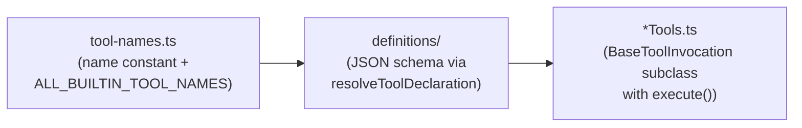

For example, `tracker_visualize` is declared as `TRACKER_VISUALIZE_TOOL_NAME` in `tool-names.ts`, its schema lives in `definitions/trackerTools.ts` as `TRACKER_VISUALIZE_DEFINITION`, and its invocation class is `TrackerVisualizeInvocation` in `trackerTools.ts`. The new `visualize` tool will follow this exact pattern.

### 3.2 The `ToolResult` Contract

A `ToolResult` (from `packages/core/src/tools/tools.ts`) has two fields that serve different audiences:

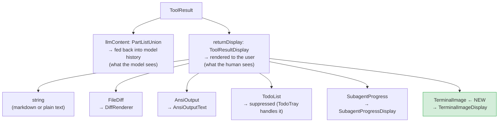

`ToolResultDisplay` is a discriminated union. Adding `TerminalImage` is a surgical, additive change—no existing branches are touched.

### 3.3 The Display Pipeline: From Tool to Terminal

This is the full path a `returnDisplay` value travels before the user sees it:

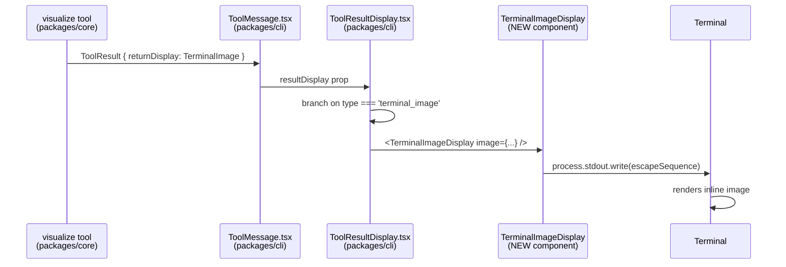

The key insight from reading `ToolResultDisplay.tsx`: it already branches on object shape (`'fileDiff' in obj`, `isSubagentProgress(obj)`, `'todos' in obj`). Adding a `type === 'terminal_image'` branch is consistent with the existing pattern.

### 3.4 The `tracker_visualize` Precedent

`tracker_visualize` is the direct ancestor of this feature. Reading `trackerTools.ts`:

1. It reads the task graph from `TrackerService`.
2. Builds an ASCII tree string.
3. Returns `{ llmContent: "...", returnDisplay: asciiTree }` as a plain `string`.

This project generalizes step 2 (ASCII string → Mermaid → raster image) and step 3 (plain string → new `TerminalImage` type). The pattern is proven; the scope is expanded.

### 3.5 Slash Command Architecture

Slash commands live in `packages/cli/src/commands/` and are loaded by `BuiltinCommandLoader`. Each is a `SlashCommand` with a `name`, `description`, and `action`. An action returns one of:

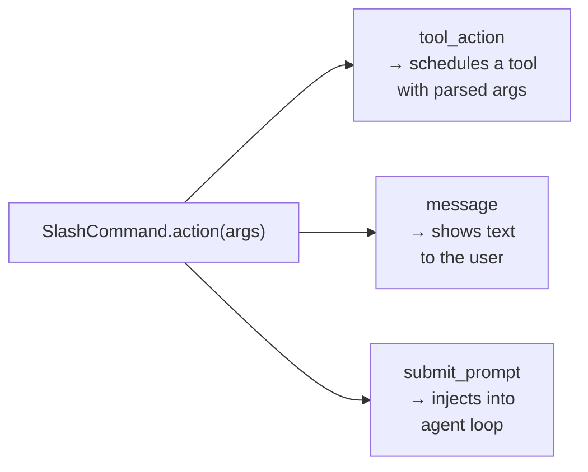

`/visualize` will return a `tool_action` that schedules the `visualize` tool with the parsed Mermaid source. This is the same pattern used by existing commands.

### 3.6 Non-Interactive Mode

`nonInteractiveCli.ts` handles `--prompt` flag execution. There is no TTY in this mode (`process.stdout.isTTY === false`). Any tool that produces terminal-specific output must detect this and fall back gracefully—otherwise piped output breaks. This is a first-class concern in the design, not an afterthought.

---

## 4. Proposed Solution

### 4.1 Goals

| # | Goal |
|---|------|
| G1 | Inline rendering of architecture diagrams (sequence, class, ERD, flowchart, state, git graph) from agent-generated or user-provided Mermaid |
| G2 | Support Kitty, iTerm2, and Sixel terminal image protocols with intelligent detection |
| G3 | Graceful ASCII/ANSI fallback for unsupported terminals; Mermaid source fallback as last resort |
| G4 | New `visualize` tool callable by the agent and by users via `/visualize` |
| G5 | Agent automatically calls `visualize` when explaining architecture or data flows |
| G6 | Disk-based LRU cache keyed by content hash to avoid redundant headless-browser rendering |
| G7 | Non-interactive mode: emit Mermaid source as fenced code block when no TTY |
| G8 | Extension path for UI component preview (headless browser screenshot → same pipeline) |

### 4.2 Non-Goals (Out of Scope for 175h)

- Interactive/editable diagrams in the terminal
- Live React/HTML component preview (architecture supports it; implementation deferred)
- A new sub-agent dedicated to diagram generation
- Diagram export to external formats beyond the cache

---

## 5. High-Level Design

### 5.1 System Architecture

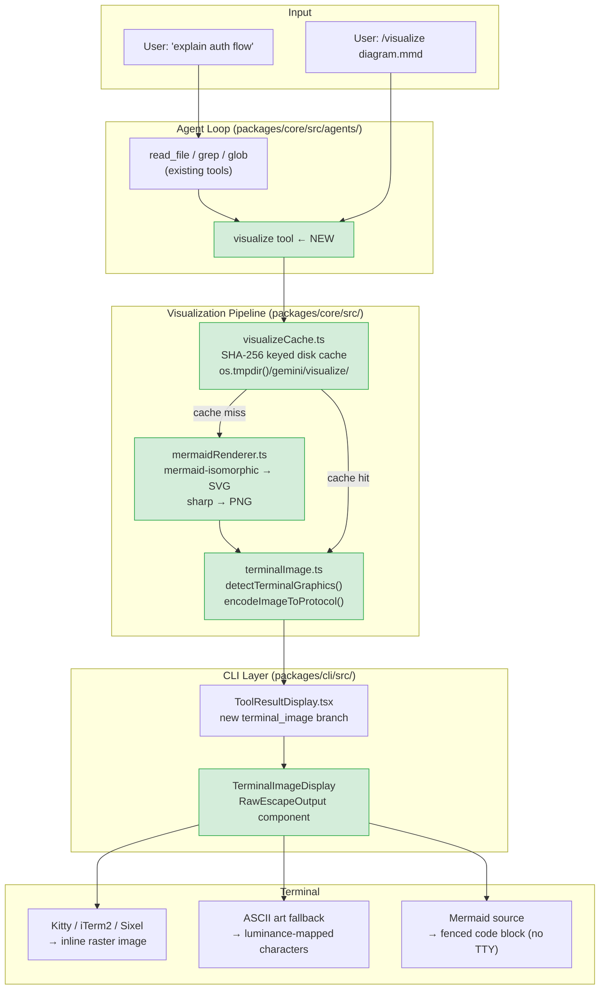

Green nodes are new. Everything else is existing infrastructure being extended.

### 5.2 End-to-End Data Flow

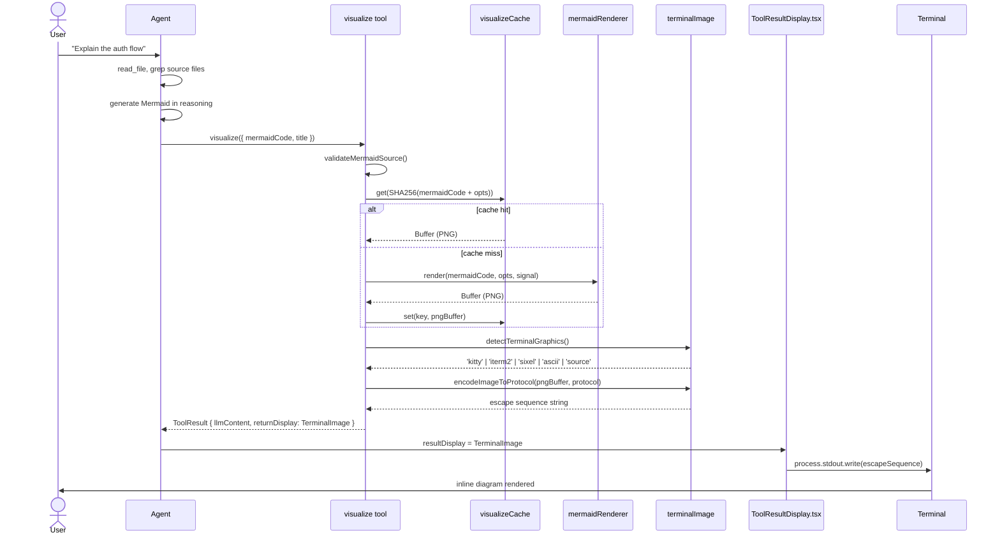

### 5.3 Terminal Protocol Detection

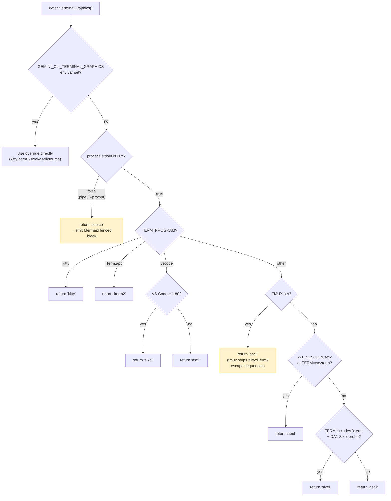

**Priority rationale:** Kitty's protocol is the most capable (chunked transfer, placement IDs, z-index control). iTerm2 is the most widely supported on macOS. Sixel has the broadest cross-platform support including Windows Terminal. ASCII art ensures every terminal gets *something* useful. The `TMUX` detection is a non-obvious but critical case—tmux strips Kitty and iTerm2 escape sequences silently, producing garbage output without this guard.

### 5.4 New Files and Their Relationships

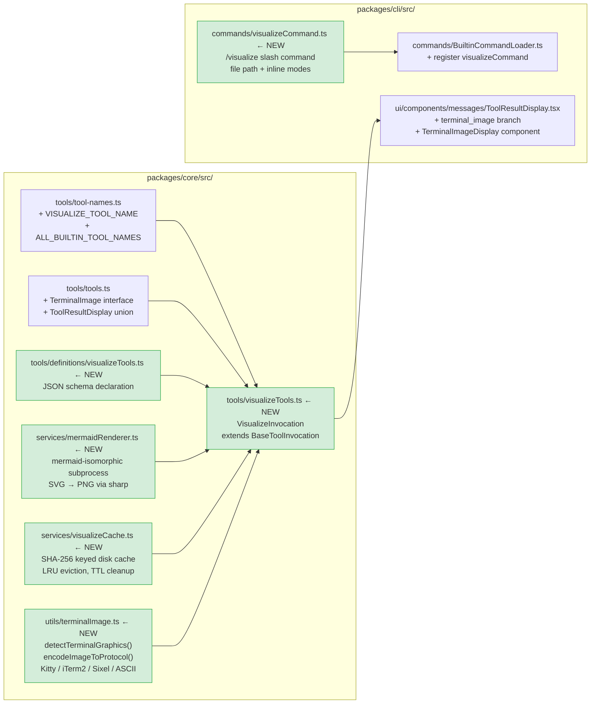

---

## 6. Detailed Component Design

### 6.1 `TerminalImage` Type Extension

**File:** `packages/core/src/tools/tools.ts`

The current `ToolResultDisplay` union in this file is:

```typescript
export type ToolResultDisplay =
  | string
  | FileDiff
  | AnsiOutput
  | TodoList
  | SubagentProgress;
```

I will add one member:

```typescript
export interface TerminalImage {
  type: 'terminal_image';
  protocol: 'kitty' | 'iterm2' | 'sixel' | 'ascii' | 'source';
  data: string;       // escape sequence, ASCII art, or Mermaid source
  title?: string;     // optional caption rendered above the image
  width?: number;     // rendered width hint (columns)
  height?: number;    // rendered height hint (rows)
}

export type ToolResultDisplay =
  | string
  | FileDiff
  | AnsiOutput
  | TodoList
  | SubagentProgress
  | TerminalImage;    // NEW
```

**Why a discriminated union over a plain string:** Keeping terminal detection in the CLI layer (not the tool) means the tool itself is terminal-agnostic and testable without a real terminal. The `protocol` field lets `TerminalImageDisplay` apply protocol-specific rendering logic (e.g. a title caption for ASCII art, a placeholder `Box` for raw escape sequences). TypeScript's exhaustive checking enforces correct handling at compile time.

### 6.2 `visualize` Tool

**File:** `packages/core/src/tools/visualizeTools.ts`

```typescript
export const VISUALIZE_TOOL_NAME = 'visualize';

interface VisualizeParams {
  mermaidCode: string;
  title?: string;
  diagramType?: 'sequenceDiagram' | 'flowchart' | 'classDiagram' | 'erDiagram'
               | 'stateDiagram' | 'gitGraph' | 'pie' | 'gantt';
  theme?: 'default' | 'dark' | 'neutral' | 'forest';
  width?: number;   // max render width in pixels, default 1200
}

class VisualizeInvocation extends BaseToolInvocation<VisualizeParams, ToolResult> {
  getDescription(): string {
    return `Rendering ${this.params.diagramType ?? 'diagram'}: ${this.params.title ?? '(untitled)'}`;
  }

  async execute(signal: AbortSignal): Promise<ToolResult> {
    const validation = validateMermaidSource(this.params.mermaidCode);
    if (!validation.ok) {
      return {
        llmContent: `Invalid Mermaid syntax: ${validation.error}`,
        returnDisplay: `Error: ${validation.error}`,
      };
    }

    const cacheKey = computeCacheKey(this.params);
    const cached = await visualizeCache.get(cacheKey);
    const pngBuffer = cached ?? await mermaidRenderer.render(
      this.params.mermaidCode,
      { theme: this.params.theme ?? 'default', width: this.params.width ?? 1200 },
      signal,
    );
    if (!cached) await visualizeCache.set(cacheKey, pngBuffer);

    const protocol = detectTerminalGraphics();
    const encoded = encodeImageToProtocol(pngBuffer, protocol, {
      title: this.params.title,
    });

    return {
      llmContent: `Rendered diagram: ${summarizeDiagram(this.params.mermaidCode)}`,
      returnDisplay: { type: 'terminal_image', protocol, data: encoded, title: this.params.title },
    };
  }
}
```

**Key design decisions:**
- `diagramType` is a hint for validation and `getDescription()`, not enforced—the Mermaid renderer accepts any valid source.
- The tool is **read-only** (no file system writes beyond the cache) and requires no user confirmation, consistent with `tracker_visualize`.
- `AbortSignal` is propagated to the renderer subprocess so `Ctrl+C` cancels an in-progress render.

### 6.3 Terminal Image Encoder

**File:** `packages/core/src/utils/terminalImage.ts`

```typescript
export type GraphicsProtocol = 'kitty' | 'iterm2' | 'sixel' | 'ascii' | 'source';

export function detectTerminalGraphics(): GraphicsProtocol {
  const override = process.env.GEMINI_CLI_TERMINAL_GRAPHICS;
  if (override && isValidProtocol(override)) return override as GraphicsProtocol;
  if (!process.stdout.isTTY) return 'source';

  const termProgram = process.env.TERM_PROGRAM ?? '';
  const term = process.env.TERM ?? '';

  if (termProgram === 'kitty') return 'kitty';
  if (termProgram === 'iTerm.app') return 'iterm2';
  if (process.env.TMUX) return 'ascii';           // tmux strips image escapes
  if (process.env.WT_SESSION) return 'sixel';     // Windows Terminal
  if (term === 'wezterm') return 'sixel';
  if (term.includes('xterm') && hasSixelSupport()) return 'sixel';

  return 'ascii';
}

export function encodeImageToProtocol(
  pngBuffer: Buffer,
  protocol: GraphicsProtocol,
  options: { title?: string; maxCols?: number } = {},
): string {
  switch (protocol) {
    case 'kitty':  return encodeKitty(pngBuffer, options);
    case 'iterm2': return encodeITerm2(pngBuffer, options);
    case 'sixel':  return encodeSixel(pngBuffer, options);
    case 'ascii':  return renderAsciiArt(pngBuffer, options);
    case 'source': return '';  // caller uses mermaidCode directly
  }
}
```

**Protocol implementations:**

- **Kitty:** Chunked base64 with `a=T` (transmit+display), `f=100` (PNG), `q=2` (suppress response). Each chunk ≤ 4096 bytes per the protocol spec.
- **iTerm2:** `ESC]1337;File=inline=1;width=auto:<base64>\a` format.
- **Sixel:** Uses the `sixel` npm package. Sixel is well-specified; the library handles palette quantization.
- **ASCII art:** Uses `sharp` to resize to `process.stdout.columns × 2` pixels, then maps pixel luminance to `@#S%?*+;:,. ` (10 levels). Recognizable for simple diagrams.

### 6.4 Mermaid Renderer Service

**File:** `packages/core/src/services/mermaidRenderer.ts`

```typescript
export interface MermaidRenderer {
  render(mermaidCode: string, options: RenderOptions, signal: AbortSignal): Promise<Buffer>;
}
```

**Implementation strategy:**

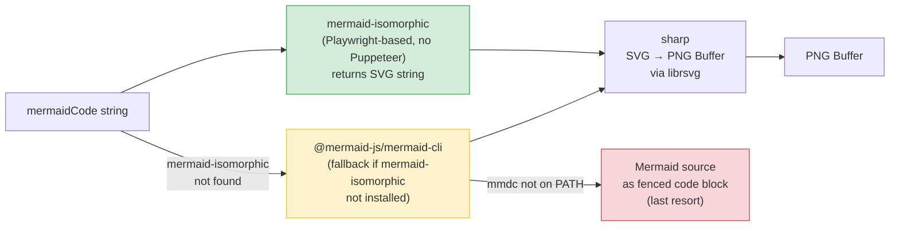

All rendering dependencies are **optional**. The tool degrades gracefully through the chain without crashing. Rendering runs in a subprocess with a 15-second `AbortSignal` timeout and a 512 MB memory limit to prevent unbounded resource use from large or malformed diagrams.

### 6.5 Cache Layer

**File:** `packages/core/src/services/visualizeCache.ts`

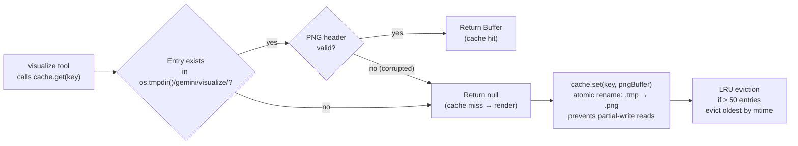

**Why disk cache over in-memory:** Headless browser startup costs ~2–3 seconds. A disk cache survives across CLI sessions—the second time a user asks "explain the auth flow" in a new session, the diagram renders in milliseconds. The cache is keyed by `SHA-256(mermaidCode + theme + width)` so any change to the diagram or options produces a new entry.

### 6.6 `ToolResultDisplay.tsx` Extension

**File:** `packages/cli/src/ui/components/messages/ToolResultDisplay.tsx`

The existing branching logic in this file checks object shapes:

```typescript
if ('todos' in truncatedResultDisplay) { ... }
else if (isSubagentProgress(truncatedResultDisplay)) { ... }
else if ('fileDiff' in truncatedResultDisplay) { ... }
```

I will add one branch, consistent with this pattern:

```typescript
} else if (
  typeof truncatedResultDisplay === 'object' &&
  'type' in truncatedResultDisplay &&
  truncatedResultDisplay.type === 'terminal_image'
) {
  content = (
    <TerminalImageDisplay
      image={truncatedResultDisplay as TerminalImage}
      terminalWidth={childWidth}
    />
  );
}
```

**`TerminalImageDisplay` component:**

```typescript
const TerminalImageDisplay: React.FC<{ image: TerminalImage; terminalWidth: number }> = ({ image }) => {
  if (image.protocol === 'ascii' || image.protocol === 'source') {
    return (
      <Box flexDirection="column">
        {image.title && <Text color="cyan" bold>{image.title}</Text>}
        <Text>{image.data}</Text>
      </Box>
    );
  }
  // Kitty/iTerm2/Sixel: Ink doesn't support raw stdout writes natively.
  // We use a useEffect to write the escape sequence once on mount,
  // then render a placeholder Box of the appropriate height so Ink's
  // layout engine reserves the correct vertical space.
  return <RawEscapeOutput data={image.data} title={image.title} />;
};
```

The `RawEscapeOutput` component uses `process.stdout.write` in a `useEffect` (run once on mount) and renders an invisible `Box` with `height` calculated from the image dimensions. This is the same technique used by Ink-based tools that need to emit raw terminal control sequences.

### 6.7 `/visualize` Slash Command

**File:** `packages/cli/src/commands/visualizeCommand.ts`

```typescript
export const visualizeCommand: SlashCommand = {
  name: 'visualize',
  description: 'Render a Mermaid diagram inline. Usage: /visualize [file.mmd | mermaid code]',
  action: async (args: string): Promise<SlashCommandActionReturn> => {
    if (!args.trim()) {
      return {
        type: 'message',
        message: 'Usage: /visualize <path/to/diagram.mmd>  or  /visualize <inline mermaid>',
      };
    }

    let mermaidCode = args.trim();
    // Single-line arg ending in .mmd → treat as file path
    if (!mermaidCode.includes('\n') && mermaidCode.endsWith('.mmd')) {
      try {
        mermaidCode = await fs.readFile(mermaidCode, 'utf8');
      } catch {
        return { type: 'message', message: `Could not read file: ${args.trim()}` };
      }
    }

    return {
      type: 'tool_action',
      toolName: VISUALIZE_TOOL_NAME,
      toolArgs: { mermaidCode },
    };
  },
};
```

### 6.8 Agent Integration

The `visualize` tool's JSON schema `description` field will include explicit guidance for the model:

```
Use this tool to render a Mermaid diagram inline in the terminal when:
- The user asks to "explain", "show", "visualize", or "diagram" an architecture, flow, or structure
- You have analyzed code and can represent relationships as a sequence, class, flowchart, or ER diagram
- A visual representation would be significantly clearer than prose alone

Call this tool AFTER gathering information (read_file, grep) and alongside your prose explanation.
Do not call it for trivial structures that are clearer as text (e.g. a two-node relationship).
```

This mirrors how `write_todos` uses its description to guide when the agent should call it, and how `tracker_visualize` is called after the agent builds a task graph. The pattern is established; this proposal extends it.

---

## 7. Edge Cases & Failure Modes

Most proposals describe the happy path. Here is what can go wrong and exactly how each failure is handled.

### 7.1 Terminal Detection Failures

| Scenario | Root Cause | Handling |
|----------|-----------|---------|
| tmux wrapping Kitty | tmux intercepts and strips Kitty/iTerm2 escape sequences silently | Detect `TMUX` env var → downgrade to `'ascii'` before encoding |
| SSH session | `TERM_PROGRAM` may not be forwarded via SSH | Falls back to `'ascii'`; document `GEMINI_CLI_TERMINAL_GRAPHICS=kitty` override for users who forward X11 or use Mosh |
| VS Code integrated terminal | `TERM_PROGRAM=vscode`; Sixel supported since VS Code 1.80 | Map `vscode` → `'sixel'`; check `VSCODE_INJECTION` for version hint |
| Windows CMD / PowerShell | No `TERM_PROGRAM`; may not have `WT_SESSION` | Falls back to `'ascii'`; Windows Terminal sets `WT_SESSION` and gets Sixel |
| CI/CD (no TTY) | `process.stdout.isTTY === false` | `detectTerminalGraphics()` returns `'source'`; tool emits Mermaid as fenced code block |
| User reports garbage output | Wrong protocol detected | `GEMINI_CLI_TERMINAL_GRAPHICS=ascii` env var overrides all detection |

### 7.2 Mermaid Rendering Failures

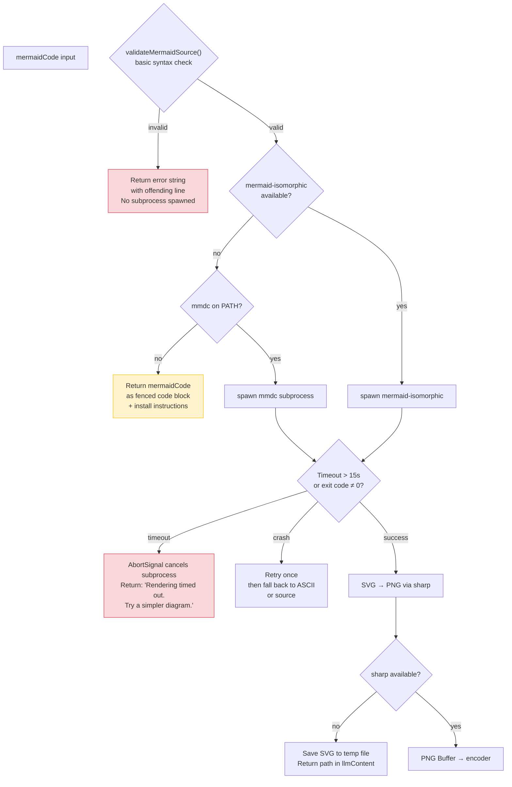

### 7.3 Image Encoding & Display Failures

| Scenario | Handling |
|----------|---------|
| Sixel encoding produces corrupted output | Wrap `encodeSixel()` in try/catch; fall back to `renderAsciiArt()` |
| Image too wide for terminal | Resize PNG to `process.stdout.columns * 8` pixels before encoding (8px/column is a safe heuristic for most fonts) |
| Kitty protocol not acknowledged | Kitty responses are optional (`q=2` suppresses them); no acknowledgment is needed |
| Ink layout conflict with raw stdout writes | `RawEscapeOutput` writes in `useEffect` (after Ink's render pass); placeholder `Box` reserves vertical space so Ink doesn't overwrite the image |

### 7.4 Caching Edge Cases

| Scenario | Handling |
|----------|---------|
| Cache directory not writable | Catch `EACCES`; fall back to in-memory `Map<string, Buffer>` for the session; log a debug warning |
| Corrupted cache entry (partial write from crash) | Validate PNG magic bytes (`\x89PNG`) on read; treat invalid entries as cache miss |
| Two concurrent `visualize` calls with same key | Write to `<hash>.tmp` then `fs.rename()` to `<hash>.png` (atomic on POSIX); second caller reads the completed file |
| Cache grows unbounded | LRU eviction at 50 entries (sorted by `mtime`); startup cleanup removes entries older than 7 days |

### 7.5 Agent Over-Calling `visualize`

The tool description explicitly states when *not* to call it. Additionally, the tool tracks call count per agent turn via a turn-scoped counter: if `visualize` has been called 3+ times in the current turn, subsequent calls return a `string` result suggesting the user use `/visualize` directly. This prevents the agent from flooding the terminal with diagrams for a single "explain everything" prompt.

---

## 8. Integration Points

| Area | Change | File |
|------|--------|------|
| Tool registry | Add `VISUALIZE_TOOL_NAME` to `ALL_BUILTIN_TOOL_NAMES` | `tools/tool-names.ts` |
| Type system | Add `TerminalImage` to `ToolResultDisplay` union | `tools/tools.ts` |
| Tool definition | New JSON schema + `VisualizeInvocation` class | `tools/visualizeTools.ts` (new) |
| Tool schema | `VISUALIZE_DEFINITION` via `resolveToolDeclaration` | `tools/definitions/visualizeTools.ts` (new) |
| CLI renderer | Branch on `type === 'terminal_image'` | `ui/components/messages/ToolResultDisplay.tsx` |
| Slash command | `visualizeCommand` registered in loader | `commands/visualizeCommand.ts` (new), `commands/BuiltinCommandLoader.ts` |
| Config | Optional: `visualize.cacheDir`, `visualize.theme`, `terminal.graphics` | `config/config.ts` |
| Non-interactive | `detectTerminalGraphics()` returns `'source'` when no TTY | `utils/terminalImage.ts` |
| Dependencies | `mermaid-isomorphic`, `sharp`, `sixel` as optional peer deps | `packages/core/package.json` |

**Dependency strategy:** All rendering dependencies are optional peer dependencies. The tool degrades gracefully if they are absent. This avoids bloating the default install for users who never use `visualize`—consistent with how gemini-cli handles optional features elsewhere.

---

## 9. Testing Strategy

### 9.1 Unit Tests

| Module | What is tested |
|--------|---------------|
| `terminalImage.ts` | `detectTerminalGraphics()` for every env var combination (Kitty, iTerm2, TMUX, WT_SESSION, no TTY, override); `encodeImageToProtocol()` output format per protocol (Kitty escape starts with `\x1b_G`, iTerm2 with `\x1b]1337`); ASCII art is non-empty for a 1×1 PNG |
| `visualizeCache.ts` | Cache miss → render called → stored; cache hit → render not called; LRU eviction at 51st entry; corrupted PNG header → cache miss; atomic rename prevents partial reads |
| `visualizeTools.ts` | Invalid Mermaid → error `returnDisplay`; valid Mermaid → `TerminalImage` returnDisplay; `llmContent` contains diagram summary; AbortSignal cancellation → error result; 4th call in same turn → rate-limit message |
| `ToolResultDisplay.tsx` | Snapshot: `TerminalImage { protocol: 'ascii' }` renders title + data; `TerminalImage { protocol: 'source' }` renders fenced code block; no regression on existing `FileDiff`, `AnsiOutput`, `SubagentProgress` branches |

### 9.2 Integration Tests

| Scenario | Approach |
|----------|---------|
| Mermaid → PNG → Kitty escape sequence | Mock `mermaidRenderer`; verify escape sequence starts with `\x1b_Ga=T,f=100` |
| Mermaid → ASCII art (real render) | Use a simple 2-node flowchart; verify output contains `+--+` or `│` box-drawing characters |
| `/visualize` with `.mmd` file path | Mock `fs.readFile`; verify `tool_action` is returned with correct `mermaidCode` |
| `/visualize` with inline Mermaid | Verify `tool_action` with the inline source |
| Non-interactive mode | Set `process.stdout.isTTY = false`; verify `protocol === 'source'` and output is a Mermaid fenced block |
| Cache hit path | Call `visualize` twice with same params; verify `mermaidRenderer.render` called exactly once |

### 9.3 Manual Acceptance Matrix

Before each milestone:

| # | Scenario | Expected |
|---|----------|---------|
| 1 | Kitty terminal: "explain the auth flow" | Sequence diagram renders inline |
| 2 | iTerm2: same prompt | Diagram renders with iTerm2 protocol |
| 3 | xterm (no graphics): same prompt | ASCII art renders, no garbage |
| 4 | `gemini --prompt "explain auth flow" \| cat` | Mermaid source in fenced block |
| 5 | `/visualize diagram.mmd` | Diagram renders from file |
| 6 | `/visualize` with pasted Mermaid | Diagram renders from inline source |
| 7 | Second identical request | Renders instantly (< 100ms, cache hit) |
| 8 | Invalid Mermaid syntax | Clear error, no crash, no subprocess spawned |
| 9 | tmux wrapping Kitty | ASCII fallback, no garbage characters |
| 10 | VS Code integrated terminal | Sixel or ASCII fallback |
| 11 | `GEMINI_CLI_TERMINAL_GRAPHICS=ascii` in Kitty | ASCII art used despite Kitty being available |
| 12 | Render timeout (injected 20s delay) | Graceful error message, no hang |

---

## 10. Implementation Timeline

**Total: 175 hours** (~12 weeks at ~15h/week, or ~8 weeks at ~22h/week)

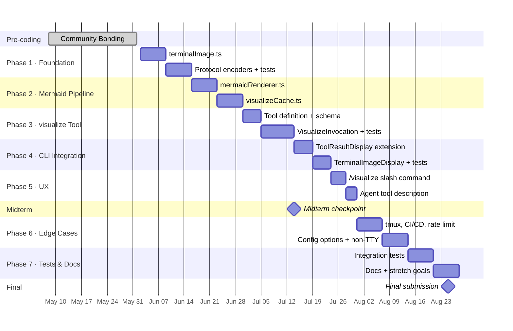

### Phase Breakdown

| Phase | Tasks | Hours |
|-------|-------|-------|
| **1. Foundation** | `terminalImage.ts`: `detectTerminalGraphics()`, Kitty encoder, iTerm2 encoder, Sixel encoder (`sixel` npm), ASCII art fallback (`sharp`), unit tests for each encoder and detection path | 35 |
| **2. Mermaid Pipeline** | `mermaidRenderer.ts`: subprocess-based rendering with `mermaid-isomorphic`, SVG → PNG via `sharp`, timeout + `AbortSignal` propagation, fallback chain. `visualizeCache.ts`: disk cache, atomic writes, LRU eviction, corruption detection | 30 |
| **3. `visualize` Tool** | `VISUALIZE_TOOL_NAME` constant, JSON schema declaration (`resolveToolDeclaration`), `VisualizeInvocation` class, registration in `ALL_BUILTIN_TOOL_NAMES`, wiring cache → renderer → encoder → `ToolResult`, unit tests | 25 |
| **4. CLI Integration** | `TerminalImage` type in `tools.ts`, `terminal_image` branch in `ToolResultDisplay.tsx`, `TerminalImageDisplay` + `RawEscapeOutput` components, snapshot tests | 20 |
| **5. Slash Command & Agent** | `/visualize` command (file + inline modes), `BuiltinCommandLoader` registration, tool description guidance for agent auto-calling | 15 |
| **6. Edge Cases & Polish** | tmux detection, CI/CD non-interactive, over-calling rate limit, config options (`visualize.theme`, `terminal.graphics` override), non-interactive file save path | 25 |
| **7. Tests & Docs** | Integration tests, manual acceptance matrix execution, user-facing docs (when diagrams appear, `/visualize` usage, env var override), contributor docs (how to add a new protocol or diagram source) | 25 |

**Stretch goals (if time permits in Phase 7):**
- `visualize({ source: 'package.json' })` → dependency flowchart (parse `dependencies`, generate Mermaid `graph LR`)
- `visualize({ source: 'git' })` → git history graph (parse `git log --graph`, generate Mermaid `gitGraph`)

---

## 11. Expected Deliverables

| Deliverable | Description |
|-------------|-------------|
| `visualize` tool | New built-in tool callable by agent and user; Mermaid in → diagram or fallback out |
| `terminalImage.ts` | `detectTerminalGraphics()` + encoders for Kitty, iTerm2, Sixel, ASCII art, source fallback |
| `mermaidRenderer.ts` | Subprocess-based renderer with timeout, abort, and optional-dependency graceful degradation |
| `visualizeCache.ts` | Disk-based LRU cache with atomic writes, corruption handling, and TTL eviction |
| `ToolResultDisplay` extension | `TerminalImage` variant in the union; `TerminalImageDisplay` + `RawEscapeOutput` in CLI |
| `/visualize` slash command | File path and inline Mermaid modes |
| Agent integration | Tool description guidance for automatic diagram generation |
| Edge case handling | tmux, CI/CD, invalid Mermaid, render timeout, cache corruption, over-calling |
| Tests | Unit tests for all new modules; integration tests for full pipeline; manual acceptance matrix |
| Documentation | User guide + contributor guide (adding protocols/diagram sources) |
| **Stretch:** Dependency graph | `package.json` / `requirements.txt` → Mermaid flowchart |
| **Stretch:** Git history | `git log` → Mermaid `gitGraph` |

---

## 12. About the Applicant

> _[Your name, university, degree program, expected graduation]_

_[Short paragraph—be specific: mention a concrete moment where you wished you had inline diagrams in a terminal tool, or a project where you worked with terminal graphics or visualization pipelines.]_

**Relevant experience:**

- **TypeScript/Node.js:** _[e.g., built X CLI tool, contributed to Y open-source project with links]_
- **Terminal/CLI UX:** _[e.g., experience with ANSI escape codes, Ink/blessed, or terminal graphics protocols—even a small PoC encoding a PNG as a Kitty escape sequence demonstrates this]_
- **Diagrams/visualization:** _[e.g., used Mermaid in documentation, built D3 visualizations, worked with SVG pipelines]_
- **Open source:** _[2–3 links to PRs or projects that demonstrate code quality, test coverage, and communication with maintainers]_

**GitHub:** [link]  
**Email:** [email]  
**Timezone:** [timezone]

---

## 13. References

- [Gemini CLI repository](https://github.com/google-gemini/gemini-cli)
- [Mermaid.js](https://mermaid.js.org/) / [mermaid-isomorphic](https://www.npmjs.com/package/mermaid-isomorphic)
- [Kitty graphics protocol](https://sw.kovidgoyal.net/kitty/graphics-protocol/)
- [iTerm2 inline images protocol](https://iterm2.com/documentation-images.html)
- [Sixel graphics (Wikipedia)](https://en.wikipedia.org/wiki/Sixel)
- [sixel npm package](https://www.npmjs.com/package/sixel)
- [sharp — Node.js image processing](https://sharp.pixelplumbing.com/)

**Codebase research (direct source reading):**
- `packages/core/src/tools/tools.ts` — `ToolResultDisplay` union, `ToolResult` interface, `BaseToolInvocation`
- `packages/core/src/tools/tool-names.ts` — `ALL_BUILTIN_TOOL_NAMES`, `TRACKER_VISUALIZE_TOOL_NAME`
- `packages/core/src/tools/trackerTools.ts` — `TrackerVisualizeInvocation` pattern (direct ancestor of this feature)
- `packages/cli/src/ui/components/messages/ToolResultDisplay.tsx` — display branching logic, `isSubagentProgress`, `fileDiff` shape check
- `packages/cli/src/commands/` — `SlashCommand` structure, `BuiltinCommandLoader`
- `packages/cli/src/nonInteractiveCli.ts` — `--prompt` flag, TTY detection
